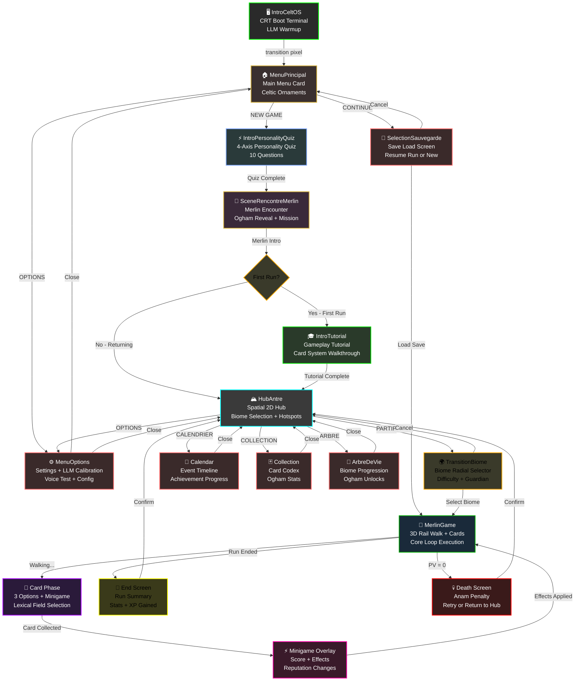

# M.E.R.L.I.N. — Flux de Scènes Complet

**Dernière mise à jour:** 2026-03-15
**Version:** 1.0
**Audience:** Développeurs Godot 4.x

---

## Vue d'ensemble

M.E.R.L.I.N. suit un flux de scènes linéaire avec embranchements conditionnels :

```
IntroCeltOS (boot)
  ↓ [transition pixel]
MenuPrincipal (menu principal + utilitaires)
  ├─ NEW GAME → IntroPersonalityQuiz (quiz 4-axes)
  │   ↓ [Merlin intro]
  │   SceneRencontreMerlin (Eveil + mission starter)
  │   ├─ [Si premier run] → IntroTutorial (tutoriel complet)
  │   │   ↓ [fin tutoriel]
  │   │   HubAntre (2D spatial hub)
  │   │
  │   └─ [Si run normal] → HubAntre
  │
  ├─ CONTINUE → SelectionSauvegarde (charger run existant)
  │   ├─ [Charger run} → MerlinGame (3D rail walk)
  │   │   ├─ [carte collected] → [minigame + effets]
  │   │   ├─ [fin run] → SceneRencontreMerlin (fin écran)
  │   │   └─ [mort] → [fin écran]
  │   │
  │   └─ [Annuler] → MenuPrincipal
  │
  └─ OPTIONS → MenuOptions (settings + calibration LLM)
      └─ [Fermer] → MenuPrincipal

HubAntre (Spatial 2D hub immersif)
  ├─ PARTIR → TransitionBiome (radial biome selector)
  │   ├─ [Choisir biome] → MerlinGame (3D rail walk)
  │   │   ├─ [Suite cartes] ↔ [minigames] ↔ [3D rail]
  │   │   ├─ [Fin normal] → [Screen fin run]
  │   │   │   ↓ [Confirmé]
  │   │   │   HubAntre
  │   │   │
  │   │   └─ [Mort (PV=0)] → [Screen mort]
  │   │       ↓ [Confirmé]
  │   │       HubAntre
  │   │
  │   └─ [Annuler] → HubAntre
  │
  ├─ OPTIONS → MenuOptions
  │   └─ [Fermer] → HubAntre
  │
  ├─ CALENDRIER → Calendar (vue événements + stats)
  │   └─ [Fermer] → HubAntre
  │
  ├─ COLLECTION → Collection (cartes jouées + stats oghams)
  │   └─ [Fermer] → HubAntre
  │
  └─ ARBRE DE VIE → ArbreDeVie (progression globale + oghams unlocked)
      └─ [Fermer] → HubAntre
```

---

## Diagramme Mermaid Complet



---

## Détails par Scène

### 1. IntroCeltOS (`scenes/IntroCeltOS.tscn`)

**Script Principal:** `scripts/IntroCeltOS.gd`

**Objectif:** Démarrage du jeu avec ambiance terminal CRT + échauffement LLM

**Flux:**
1. **Phase 1 — Terminal Boot (2s)**
   - 8 lignes de texte s'affichent avec débit terminal
   - Couleur phosphor_dim → amber
   - SFX: `boot_line` (répétés), `boot_confirm` (final)

2. **Phase 2 — Logo CeltOS (1.5s)**
   - Logo "MERLIN" en blocs Tetris (5 lignes × 23 colonnes)
   - Blocs chutent depuis le haut avec rebond
   - Flash amber → phosphor
   - SFX: `block_land` (par bloc), `flash_boom` (flash final)

3. **Phase 3 — Barre de chargement (2-3s)**
   - "Initialisation du systeme druidique..." → "Chargement des runes..." → "Eveil de M.E.R.L.I.N..."
   - Barre progresse 0% → 100% avec Tween TRANS_SINE
   - Attend LLM warmup si nécessaire

**Entrée Conditions:**
- Lancement du jeu (entry point ou depuis bootstrap)

**Sortie Conditions:**
- Phase 3 complétée + LLM warmup done

**Transition:**
- `PixelTransition.transition_to("res://scenes/MenuPrincipal.tscn")`

**État Global:**
- `MusicManager.play_intro_music()`
- Souris cachée (Input.MOUSE_MODE_HIDDEN)
- Autoload MerlinVisual et SFXManager requis

---

### 2. MenuPrincipal (`scenes/MenuPrincipal.tscn`)

**Script Principal:** `scripts/MenuPrincipalMerlin.gd`

**Objectif:** Menu principal avec 3 options + utilitaires (calendrier, collection)

**UI Elements:**
```
┌─────────────────────────────┐
│     M  E  R  L  I  N        │  (Title)
├─────────────────────────────┤
│    ◇ ─────────── ◇          │  (Separator)
├─────────────────────────────┤
│      [NEW GAME]             │  Bouton primaire
│     [CONTINUE]              │  Bouton secondaire
│     [OPTIONS]               │  Bouton tertiaire
└─────────────────────────────┘
```

**Boutons Principaux:**
| Bouton | Scene | Condition |
|--------|-------|-----------|
| NEW GAME | `IntroPersonalityQuiz.tscn` | Toujours actif |
| CONTINUE | `SelectionSauvegarde.tscn` | Actif si save existe |
| OPTIONS | `MenuOptions.tscn` | Toujours actif |

**Utilitaires (coins):**
- **Calendrier** (coin haut-droit) → `Calendar.tscn`
- **Collection** (coin bas-droit) → `Collection.tscn`
- **Horloge** (coin haut-gauche) — affichage temps réel

**Animation d'Entrée:**
- Card slide-in depuis droite (300px) + fade
- Celtic ornaments animated (fade + scale)
- Mist layer parallax

**État Global:**
- Musique: ambiance menu (boucle)
- Souris visible

**Transitions:**
```gdscript
# NEW GAME
PixelTransition.transition_to("res://scenes/IntroPersonalityQuiz.tscn")

# CONTINUE
PixelTransition.transition_to("res://scenes/SelectionSauvegarde.tscn")

# OPTIONS
PixelTransition.transition_to("res://scenes/MenuOptions.tscn")
```

---

### 3. IntroPersonalityQuiz (`scenes/IntroPersonalityQuiz.tscn`)

**Script Principal:** `scripts/IntroPersonalityQuiz.gd`

**Objectif:** Déterminer l'archétype joueur via quiz 4-axes (10 questions)

**Système des 4 Axes:**
```
Approche:  prudent (-) ↔ audacieux (+)
Relation:  solitaire (-) ↔ social (+)
Esprit:    analytique (-) ↔ intuitif (+)
Cœur:      pragmatique (-) ↔ compassionnel (+)
```

**8 Archetypes:**
| Archetype | Pattern | Description |
|-----------|---------|-------------|
| Gardien | {approche: -1, cœur: +1} | Protecteur bienveillant |
| Explorateur | {approche: +1, esprit: +1} | Audacieux et instinctif |
| Sage | {relation: -1, esprit: -1} | Solitaire analytique |
| Héros | {approche: +1, relation: +1} | Leader courageux |
| Guérisseur | {cœur: +1, relation: +1} | Empathe social |
| Stratège | {esprit: -1, approche: -1} | Calculateur prudent |
| Mystique | {esprit: +1, relation: -1} | Intuitif solitaire |
| Guide | {cœur: +1, esprit: +1} | Mentor bienveillant |

**Flux Quiz:**
1. **Intro Fade-in** (1.5s)
   - Carte apparaît depuis noir
   - "Qui es-tu dans cette forêt?" (titre dynamique)

2. **Questions Séquentielles** (10 questions × ~15s = 2.5min)
   - Chaque question fade-in + typewriter effect
   - 4 choix = boutons animés (stagger 0.15s)
   - Sélection = fade-out question + calcul axes
   - Barre progression visible

3. **Résultat Archétype** (2s)
   - Nom complet de l'archétype
   - Description personnalisée
   - "Continue" pour avancer

**Entrée Conditions:**
- MenuPrincipal → NEW GAME

**Sortie Conditions:**
- 10ème réponse confirmée

**Transition:**
```gdscript
# Signal: quiz_completed(traits: Dictionary)
PixelTransition.transition_to("res://scenes/SceneRencontreMerlin.tscn")
```

**État Sauvegardé:**
```gdscript
MerlinStore.player_personality = {
  "archetype": String,      # "gardien", "explorateur", etc.
  "axes": Dictionary,       # {"approche": int, "relation": int, ...}
  "traits": Array[String]   # [trait1, trait2, ...]
}
```

---

### 4. SceneRencontreMerlin (`scenes/SceneRencontreMerlin.tscn`)

**Script Principal:** `scripts/SceneRencontreMerlin.gd`

**Objectif:** Première rencontre avec Merlin — dialogue narratif + révélation Ogham starter + mission

**Phase: LLM_INTRO**

**Dialogue:**
- **Source:** LLM (Qwen 3.5 via Ollama) PRIORITAIRE
- **Fallback:** `res://data/dialogues/scene_dialogues.json` (dialogue statique)
- Typewriter effect avec délai 0.011s par caractère
- Blips audio (0.04 volume) à chaque caractère
- Ponctuation pause 0.028s

**Structure Dialogue:**
1. **Greeting** (~10s)
   - Merlin te salue par archétype
   - Reconnaissance personnalisée basée sur personality.traits

2. **Ogham Reveal** (~8s)
   - Panneau Ogham apparaît (panneau dédié)
   - Présentation du starter : Beith, Luis ou Quert
   - Explication gameplay brève (max 2 lignes)

3. **Mission Statement** (~6s)
   - "Tu dois traverser 8 biomes..."
   - "Chaque biome teste une faction..."
   - Mention du boss final: "Morgane t'attend"

**Boutons Réponse:**
- 2 options (oui/non ou choix narratif)
- Sélection détermine biome suggéré (CLASS_TO_BIOME)

**Déclenchement Tutoriel:**
- **Si première run** (`MerlinStore.run_count == 0`):
  - Après dialogue → IntroTutorial
- **Sinon** → HubAntre direct

**Entrée Conditions:**
- IntroPersonalityQuiz complétée
- OU LoadGame depuis SelectionSauvegarde (lecture depuis save)

**Sortie Conditions:**
- Dialogue complet + bouton réponse cliqué

**Transitions:**
```gdscript
if first_run:
  _next_scene = SCENE_TUTORIAL  # "res://scenes/IntroTutorial.tscn"
else:
  _next_scene = SCENE_HUB       # "res://scenes/HubAntre.tscn"

PixelTransition.transition_to(_next_scene)
```

**État Global:**
- `MerlinStore.merlin_confidence` = 25 (starter confidence T0)
- `MerlinStore.starter_ogham` = chosen ogham
- `MerlinStore.first_run_completed = true` (après transition)

---

### 5. IntroTutorial (`scenes/IntroTutorial.tscn`)

**Script Principal:** `scripts/IntroTutorial.gd`

**Objectif:** Tutoriel complet gameplay — cartes, minigames, effets, factions (5-10 min)

**Sections Tutoriel:**

| Section | Duration | Content |
|---------|----------|---------|
| 1. Card System | 2min | 3 options, choix narratif → minigame |
| 2. Lexical Field | 1.5min | 8 champs lexicaux + verbes (45 total) |
| 3. Minigame | 2min | Scoring + feedback |
| 4. Effects | 1.5min | Reputation changes, healing, effects |
| 5. Factions | 1min | 5 factions 0-100, thresholds 50/80 |
| 6. Safe First Run | 1.5min | "Can't die" mode, protected first card |

**UI Overlays:**
- Flèches pointant éléments clés
- Texte explicatif positionnés dynamiquement
- "Press to continue" entre sections
- Skip button visible (coin haut-droit)

**Gameplay Simplifié:**
- 1 carte de démonstration obligatoire
- 3 choix pré-écrits = 3 minigames différents
- Pas de mort possible (protection T0)
- Pas de pénalité Anam

**Entrée Conditions:**
- SceneRencontreMerlin → Si MerlinStore.run_count == 0

**Sortie Conditions:**
- Toutes sections complétées OU "Skip Tutorial" cliqué

**Transition:**
```gdscript
PixelTransition.transition_to(SCENE_HUB)  # "res://scenes/HubAntre.tscn"
```

**État Post-Tutoriel:**
- `MerlinStore.tutorial_completed = true`
- `MerlinStore.run_count = 1`
- Première run "protégée" — sauvegardée avec checkpoint

---

### 6. SelectionSauvegarde (`scenes/SelectionSauvegarde.tscn`)

**Script Principal:** `scripts/SelectionSauvegarde.gd`

**Objectif:** Charger une sauvegarde existante ou retourner au menu

**UI Layout:**
```
┌─────────────────────────────────────────┐
│        Sauvegardes Disponibles          │
├─────────────────────────────────────────┤
│  [Save 1] - Run 15/Biome: Broceliande  │
│  [Save 2] - Run 8/Biome: Cotes Sauv.   │
│  [Save 3] - Run 23/Biome: Cercles      │
├─────────────────────────────────────────┤
│  [← ANNULER]           [CHARGER →]      │
└─────────────────────────────────────────┘
```

**Affichage Save:**
- Miniature biome (couleur + icône)
- Run count + biome name
- Last playtime
- Progression bar (cartes jouées / total)

**Actions:**
- **Sélectionner save** → highlight + détails
- **CHARGER** → Charge run et lance MerlinGame
- **ANNULER** → Retour MenuPrincipal

**Chargement Run:**
- Lit `MerlinStore.run_state` (JSON compressé)
- Restaure:
  - Faction scores
  - Cartes jouées dans run courant
  - Minigame history
  - Position 3D (y-coordinate de marche)
  - PV courant

**Entrée Conditions:**
- MenuPrincipal → CONTINUE
- Au moins 1 save valide (MerlinStore.saves array non-vide)

**Sortie Conditions:**
- CHARGER cliqué → MerlinGame lancé
- ANNULER cliqué → MenuPrincipal

**Transitions:**
```gdscript
# Load + Launch
var save_data = MerlinStore.get_save(selected_index)
MerlinStore.restore_run_state(save_data)
PixelTransition.transition_to("res://scenes/MerlinGame.tscn")

# Back to menu
PixelTransition.transition_to("res://scenes/MenuPrincipal.tscn")
```

---

### 7. MenuOptions (`scenes/MenuOptions.tscn`)

**Script Principal:** `scripts/MenuOptions.gd`

**Objectif:** Réglages jeu + calibration LLM (voice pitch, variation, speed)

**Sections:**

#### 7.1 Gameplay Settings
- Résolution écran
- Vsync on/off
- Master volume
- Music volume
- SFX volume
- Sous-titres on/off

#### 7.2 LLM Calibration Panel
```
┌─────────────────────────────────┐
│   Calibrage M.E.R.L.I.N. Voice  │
├─────────────────────────────────┤
│ Pitch:     [●————]  1.0         │
│ Variation: [——●——]  0.5         │
│ Speed:     [————●]  1.2         │
│                                 │
│  [TEST] "Bonjour, je suis..."   │
│                                 │
│  LLM Status: Connected ✓        │
└─────────────────────────────────┘
```

- **Pitch slider** (0.7 - 1.3) — hauteur voix TTS
- **Variation slider** (0.0 - 1.0) — stabilité/naturalité
- **Speed slider** (0.8 - 1.5) — débit parole
- **TEST button** — démonstration en temps réel

#### 7.3 LLM Status Badge
- Affiche connexion Ollama
- Refresh timeout (30s)
- Model info: `merlin-narrator-lora:latest`
- Quantization: `Q4_K_M` (si applicable)

**Entrée Conditions:**
- MenuPrincipal → OPTIONS
- HubAntre → OPTIONS (coin menu)

**Sortie Conditions:**
- Bouton [BACK] cliqué

**Transitions:**
```gdscript
# Si venu de MenuPrincipal
PixelTransition.transition_to("res://scenes/MenuPrincipal.tscn")

# Si venu de HubAntre
PixelTransition.transition_to("res://scenes/HubAntre.tscn")
```

**État Sauvegardé:**
```ini
# config.cfg (user://)
[audio]
master_volume = 0.8
music_volume = 0.7
sfx_volume = 0.9

[llm]
tts_pitch = 1.0
tts_variation = 0.5
tts_speed = 1.2
```

---

### 8. HubAntre (`scenes/HubAntre.tscn`)

**Script Principal:** `scripts/HubAntre.gd`

**Objectif:** Hub spatial 2D immersif — sélection biome + points d'intérêt (4 hotspots)

**Vue Layout:**
```
    ┌──────────────────────────────────┐
    │  🗓️ Calendrier                   │ OPTIONS ⚙️
    │  (coin haut-gauche)              │ (coin haut-droit)
    ├──────────────────────────────────┤
    │                                  │
    │       [Antre Spatial]            │
    │   Merlin Greeting Bubble         │
    │   "Quel biome choisis-tu?"       │
    │                                  │
    │        [PARTIR →]                │
    │    (Biome Radial Selector)       │
    │                                  │
    │                                  │
    ├──────────────────────────────────┤
    │  📚 Collection                   │ 🌳 Arbre de Vie
    │  (coin bas-gauche)               │ (coin bas-droit)
    └──────────────────────────────────┘
```

**Hotspots Interactifs (4):**

| Hotspot | Scene | Action |
|---------|-------|--------|
| 🗓️ Calendrier | `Calendar.tscn` | Voir événements + progression |
| ⚙️ Options | `MenuOptions.tscn` | Réglages + LLM calibration |
| 📚 Collection | `Collection.tscn` | Codex cartes + stats oghams |
| 🌳 Arbre de Vie | `ArbreDeVie.tscn` | Progression biomes + unlocks |

**Bouton PARTIR:**
- Transition vers **TransitionBiome**
- Radial selector affiche 8 biomes
- Couleurs + difficulté + gardien révélés

**Merlin Greeting:**
- Apparition speech bubble (~2s)
- LLM-generated greeting basé sur:
  - Nombre runs complétés
  - Biome frequency (quel biome joué le plus?)
  - Merlin confidence level (T0-T3)
- "Quel biome choisis-tu pour cette aventure?"

**Biome Data (8 sanctuaires):**
```gdscript
const BIOME_DATA := {
  "foret_broceliande": {
    "name": "Forêt de Brocéliande",
    "subtitle": "Mystère et magie ancestrale",
    "color": MerlinVisual.GBC.forest,
    "ogham": "duir",
    "guardian": "Maelgwn",
    "season": "automne",
    "difficulty_label": "Normal",
  },
  # ... 7 autres biomes
}
```

**Entrée Conditions:**
- IntroTutorial complétée → _transition_to_hub()
- MerlinGame fin run normal → [End Screen] → confirmé
- MerlinGame mort → [Death Screen] → confirmé
- SelectionSauvegarde → Load Game complet → restore run
- MenuOptions → Close → retour depuis options

**Sortie Conditions:**
- PARTIR cliqué → TransitionBiome
- Hotspot cliqué → Scene correspondante

**Transitions:**
```gdscript
# PARTIR (Biome selection)
PixelTransition.transition_to(SCENE_TRANSITION)  # TransitionBiome.tscn

# Hotspots
if btn == calendar_btn:
  PixelTransition.transition_to(SCENE_CALENDAR)
elif btn == options_btn:
  PixelTransition.transition_to(SCENE_OPTIONS)
elif btn == collection_btn:
  PixelTransition.transition_to(SCENE_COLLECTION)
elif btn == arbre_btn:
  PixelTransition.transition_to(SCENE_ARBRE)
```

**État Global:**
- Hotspots activés/désactivés basés sur progression
- Arbre de Vie grisé si aucun ogham unlockable

---

### 9. TransitionBiome (`scenes/TransitionBiome.tscn`)

**Script Principal:** `scripts/TransitionBiome.gd`

**Objectif:** Sélecteur radial biome — visualisation 8 biomes + difficultés

**UI Layout:**
```
         [Annuler]
            ↑
            │
    NW ─────┼───── NE
    ↙   \   │   /   ↘
        ╱   │   ╲
        ╱ MERLIN  ╲
       │   Radial  │
    SW ┤    Wheel   ├ SE
       │            │
        ╲  biomes  ╱
        ╲   │   ╱
    ↙   ╲   │   ╱   ↘
    W ─────┼───── E
            │
           ↓
        [Sélect.]
```

**8 Positions (Cardinal + Diagonale):**
- N: Broceliande (center-ish, "home")
- NE: Côtes Sauvages
- E: Villages Celtes
- SE: Landes de Bruyère
- S: Cercles de Pierres
- SW: Marais des Korrigans
- W: Collines aux Dolmens
- NW: Îles Mystiques

**Affichage Biome (hover):**
```
     ┌────────────────────┐
     │  Forêt Brocéliande │  (name)
     │ Mystère & Magie    │  (subtitle)
     ├────────────────────┤
     │ Gardien: Maelgwn   │
     │ Saison: Automne    │
     │ Difficulté: Normal │
     │ Ogham: Duir 🌳     │
     └────────────────────┘
```

**Interactions:**
- **Hover biome** → Popup + highlight
- **Click biome** → Sélection + confirmation
- **CONFIRMER** → Lance MerlinGame avec seed biome
- **ANNULER** → Retour HubAntre

**Entrée Conditions:**
- HubAntre → PARTIR

**Sortie Conditions:**
- CONFIRMER cliqué avec biome sélectionné → MerlinGame
- ANNULER cliqué → HubAntre

**Transitions:**
```gdscript
# Launch game
MerlinStore.current_biome = selected_biome
MerlinStore.new_run_started()
PixelTransition.transition_to(SCENE_GAME)  # MerlinGame.tscn

# Back to hub
PixelTransition.transition_to(SCENE_HUB)
```

**État Créé:**
```gdscript
MerlinStore.new_run_state = {
  "biome": String,
  "run_id": int,
  "started_at": int,  # Unix timestamp
  "seed": int,        # Déterministe par biome
  "cards_played": [],
  "factions": {"faction": 50, ...},
  "pv": 100,
  "merlin_confidence": 25,  # T0
}
```

---

### 10. MerlinGame (`scenes/MerlinGame.tscn`)

**Script Principal:** `scripts/ui/merlin_game_controller.gd` + sous-scènes

**Objectif:** Cœur du jeu — boucle de jeu 3D (rail walk + cartes + minigames)

**Architecture 3D + UI 2D:**
```
[3D Scene: BroceliandeForest3D]
  ├─ Camera rail (Y-axis forward)
  ├─ Terrain procedural (8 biomes)
  ├─ Vegetation chunked
  ├─ Creatures (visual only)
  └─ Walk HUD (overlay)
      ├─ PV bar
      ├─ Cartes collected (small icons)
      ├─ Merlin confidence badge
      └─ Minimap (biome progress)

[2D Overlay: MerlinGameUI]
  ├─ Card Panel (3 options)
  ├─ Minigame Overlay (lexical field)
  └─ Effect Screen (reputation changes)
```

**Flux Principal (boucle de run):**

```
1. SPAWN (Début du run)
   ├─ Restore run_state si LoadGame
   ├─ Initialize factions = default ou saved
   ├─ PV = 100 (ou restored)
   ├─ Merlin confidence = 25 (ou restored)
   └─ Start walk

2. WALK (Marche 3D)
   ├─ Camera avance Y-axis
   ├─ Terrain generé (chunks)
   ├─ Creatures spawned (visuels)
   ├─ Audio: musique ambiance + SFX walk
   └─ Duration: 5-15s random per card collect

3. COLLECT (Découverte carte)
   ├─ Animation particle burst
   ├─ Card floats + rotates
   ├─ Fade-in Card Panel
   └─ Wait for player choice

4. CARD PHASE (3 options affichées)
   ├─ LLM-generated 3 options (ou fallback static)
   ├─ Lexical field assigné (8 + neutre)
   ├─ Typewriter effect + audio blips
   ├─ Player selects 1 option
   └─ → Minigame overlay triggers

5. MINIGAME (Lexical field scoring)
   ├─ Overlay affiche 4 verbes
   ├─ Speed challenge: player clicks verbes matching champ
   ├─ Score: 0-100 basé sur temps + accuracy
   ├─ Screen shake + particle feedback
   └─ Effect applied (faction ±20, PV heal/damage)

6. EFFECTS (Appliquer effets, vérifier mort)
   ├─ Pipeline: DRAIN → CARTE → OGHAM → CHOIX → MINIGAME → SCORE → EFFECTS → PROTECT → MORT?
   ├─ Si PV > 0: retour WALK (boucle)
   ├─ Si PV ≤ 0: → MORT (End Screen type = "death")
   └─ Si cartes.size() ≥ 30: → FIN (End Screen type = "normal")

7. END SCREEN (Résumé run)
   ├─ Total cartes jouées
   ├─ Factions finales (5 gauges)
   ├─ XP total
   ├─ Biome maturité score
   ├─ Oghams unlocked (si applicable)
   ├─ Anam penalty (si mort)
   └─ [CONTINUE] → HubAntre
```

**Card System (Détails):**
- **Source LLM:** Qwen 3.5-4B via Ollama (per-faction prompts)
- **Fallback:** 500+ cartes hardcoded par biome (FAST_ROUTE)
- **Structure:**
  ```json
  {
    "text": "Tu découvres une source d'eau claire.",
    "options": [
      {
        "text": "Boire l'eau magique",
        "lexical_field": "eau",
        "faction": "druides",
        "effect": "HEAL_LIFE:20"
      },
      // ... 2 autres
    ]
  }
  ```

**Minigame (Champ Lexical):**
- 8 champs + neutre: `eau, feu, terre, air, lumière, ombre, vie, mort, neutre`
- 45 verbes totaux (5 per champ)
  ```
  eau: boire, nager, couler, purifier, déluge
  feu: brûler, consumer, éclairer, grandir, dévaster
  ...
  ```
- **Scoring:** Vitesse (time_multiplier) × Accuracy (correct/total)
- **Max:** 100 (tous verbes corrects en < 5s)
- **Penalty:** -2/sec si délai > 10s

**Effet Engine (Pipeline):**
```
1.DRAIN -1          → PV -= 1
2.CARTE             → Faction ±X (basé option LF)
3.OGHAM?            → Si ogham activé: special effect
4.CHOIX             → Second faction effect (si cross-faction)
5.MINIGAME          → Multiplicateur score (x0.8 - x1.5)
6.SCORE             → Appliquer multiplicateur
7.EFFETS            → HEAL/DAMAGE, ADD_REP, PROMISE, etc.
8.PROTECTION        → Si Merlin confidence T2+: ignore 1 damage
9.VIE=0?            → Si PV ≤ 0: mort
10.PROMESSES        → Resolve cross-run promises (T3)
11.COOLDOWN         → Ogham cooldown -= 1
12.RETOUR 3D        → Fade minigame, return to walk
```

**Entrée Conditions:**
- TransitionBiome → CONFIRMER (new run)
- SelectionSauvegarde → CHARGER (resumed run)
- MerlinGame lancé via `MerlinStore.launch_run(biome_name)`

**Sortie Conditions:**
- PV ≤ 0 → Death Screen
- Cards ≥ 30 → Normal End Screen
- Player click "Hub" mid-run → soft save + HubAntre

**Transitions:**
```gdscript
# Death
PixelTransition.transition_to(SCENE_END_SCREEN)  # Shows "MORT"

# Normal end
PixelTransition.transition_to(SCENE_END_SCREEN)  # Shows summary

# Abort
soft_save_run_state()
PixelTransition.transition_to(SCENE_HUB)
```

**État Global:**
- `MerlinStore.run_state` — updated real-time
- `MerlinStore.factions` — dynamic reputation
- `MerlinStore.anam` — death counter (cross-run)
- Cards telemetry JSON logged (pour analytics)

---

### 11. End Screen (intégré MerlinGame)

**Moment d'Affichage:** Après card 30 OU PV = 0

**UI Deux Modes:**

#### 11.1 Normal Fin (Victoire Morale)
```
┌─────────────────────────────────┐
│        RUN COMPLET              │
├─────────────────────────────────┤
│ Cartes jouées: 32               │
│ Biome: Forêt Brocéliande        │
│ Durée: 15:23                    │
├─────────────────────────────────┤
│ Factions Finales:               │
│ Druides:   ████████░░  78       │
│ Guerriers: ██░░░░░░░░  32       │
│ Bardes:    ██████░░░░░  54      │
│ Éclaireurs:████████░░░  71      │
│ Mystiques: ██░░░░░░░░░  18      │
├─────────────────────────────────┤
│ XP Gagné: 450                   │
│ Maturité Biome: 12/25           │
│ Oghams: Aucun                   │
│                                 │
│        [CONTINUER] →            │
└─────────────────────────────────┘
```

#### 11.2 Mort (Game Over)
```
┌─────────────────────────────────┐
│         TU ES MORT              │
├─────────────────────────────────┤
│ Cartes jouées: 18               │
│ Pénalité Anam: -20 PV           │
│ (Total Anam: 180)               │
├─────────────────────────────────┤
│ Factions:                       │
│ Druides:   ███░░░░░░░  31       │
│ ...                             │
├─────────────────────────────────┤
│ XP Gagné: 180                   │
│ "La forêt récupère ce qui       │
│  lui appartient..."             │
│                                 │
│        [RETOUR AU HUB] →        │
└─────────────────────────────────┘
```

**Timing:**
- Écran visible 5-10s minimum
- [CONTINUER] débloqué après 2s
- Peut être skipper avec ESC

**Transition:**
```gdscript
PixelTransition.transition_to(SCENE_HUB)
```

---

### 12. Utilités: Calendar, Collection, ArbreDeVie

#### 12.1 Calendar (`scenes/Calendar.tscn`)

**Objectif:** Afficher timeline événements + progression général

- Vue calendrier (mensuelle ou semaine)
- Événements taggés: run completed, biome unlocked, ogham gained, etc.
- Filtres: all / runs / unlocks / achievements
- Graph progression: avg PV per run, factions over time
- Bouton FERMER → retour HubAntre

#### 12.2 Collection (`scenes/Collection.tscn`)

**Objectif:** Codex cartes + statistiques oghams

- Grille cartes jouées (filtrées biome/faction)
- Clic = détails: texte complet, LF, faction, fréquence jouée
- Stats Oghams: nom, level, cooldown, usage count, XP
- Graph distribution lexical fields
- Bouton FERMER → retour HubAntre

#### 12.3 ArbreDeVie (`scenes/ArbreDeVie.tscn`)

**Objectif:** Progression biomes + arbre d'unlock Oghams

- 8 nœuds biomes (cercles)
- Progression bar per biome (maturité: runs×2 + fins×5 + oghams×3 + max_rep×1)
- Oghams déblocables:
  - 3 starters toujours disponibles (Beith, Luis, Quert)
  - 6 oghams unlock à biome maturité seuils
  - 9 legendaire oghams unlock à fin run spécifiques
- Hover node = tooltip maturité + oghams disponibles
- Bouton FERMER → retour HubAntre

---

## Conditions et Transitions Clés

### Conditions de Déverrouillage

| Élément | Condition | Moment |
|---------|-----------|--------|
| IntroTutorial | `MerlinStore.run_count == 0` | SceneRencontreMerlin |
| CONTINUE (menu) | `MerlinStore.saves.size() > 0` | MenuPrincipal affichage |
| Hotspots HubAntre | `run_count > 0` (si first_run_only) | HubAntre rendu |
| Arbre de Vie accès | Aucune (toujours actif) | HubAntre |
| Oghams tier 2 | Biome maturité ≥ 10 | ArbreDeVie unlock |
| End Screen affichage | PV ≤ 0 OU cards ≥ 30 | MerlinGame |

### Points de Sauvegarde

| Scene | Save Type | Data |
|-------|-----------|------|
| MenuPrincipal | Aucune | Profile persistant seulement |
| IntroPersonalityQuiz | **Nouveau profil** | personality, archetype |
| SceneRencontreMerlin | Update profil | merlin_confidence=25, starter_ogham |
| MerlinGame mid-run | **Soft save** (run_state) | Cartes jouées, factions, PV, position 3D |
| End Screen | **Save final** + profil | Profil stats updated (run_count++, anam, etc.) |

### Pixel Transition (Système Global)

Toutes les transitions utilisent **PixelTransition.transition_to(scene_path)**:
- Effet d'éclaircissement pixels (rétrécissement)
- Durée: 0.3s par défaut
- Custom profiles supportés (couleur, durée, direction)

```gdscript
# Standard
PixelTransition.transition_to("res://scenes/HubAntre.tscn")

# Custom
var profile = {
  "duration": 0.5,
  "color": Color.BLACK,
  "direction": "inward"  # "outward", "inward", "diagonal"
}
PixelTransition.transition_to("res://scenes/MenuPrincipal.tscn", profile)
```

---

## State Persistence

### MerlinStore (Autoload Redux-like)

```gdscript
class_name MerlinStore
extends Node

# ══════════════════════════════
# PROFILE (Persistant Cross-Run)
# ══════════════════════════════

var player_name: String
var player_class: String  # druide, guerrier, barde, eclaireur
var personality: Dictionary  # archetype, axes, traits
var run_count: int = 0
var total_xp: int = 0
var anam: int = 0  # Death counter (cross-run)
var merlin_confidence: int = 25  # T0-T3 (0-100 clamp)

# Factions (Persistent)
var faction_scores: Dictionary = {
  "druides": 50,
  "guerriers": 50,
  "bardes": 50,
  "eclaireurs": 50,
  "mystiques": 50
}

# Oghams
var oghams_unlocked: Array[String] = []
var ogham_levels: Dictionary = {}

# ══════════════════════════════
# RUN STATE (Ephémère)
# ══════════════════════════════

var run_state: Dictionary = {}  # Serialized mid-run

var current_biome: String
var run_id: int
var cards_played: Array[Dictionary] = []
var pv: int = 100
var seed: int = 0

# ══════════════════════════════
# SAVES (Tableau)
# ══════════════════════════════

var saves: Array[Dictionary] = []  # Checkpoints sauvegardés

func get_save(index: int) -> Dictionary:
  return saves[index] if index < saves.size() else {}

func save_run() -> void:
  # Créer snapshot et l'ajouter à saves[]
  pass

func restore_run_state(save_data: Dictionary) -> void:
  # Restaurer run_state complet
  pass
```

### Fichiers Persistants

| Fichier | Localisation | Contenu |
|---------|--------------|---------|
| `settings.cfg` | `user://` | Audio levels, LLM pitch, resolution |
| `profile.json` | `user://` | Player name, personality, run_count, faction_scores |
| `saves.json` | `user://` | Array de run_states pour CONTINUE |
| `telemetry.jsonl` | `user://` | Card distribution, minigame scores, effects log |

---

## Flux Conditionnel Détaillé

### Scénario 1: Première Run (Nouveau Joueur)

```
IntroCeltOS
  ↓ [2.5s animation]
MenuPrincipal
  ↓ [clic NEW GAME]
IntroPersonalityQuiz (10 questions)
  ↓ [archetype déterminé]
SceneRencontreMerlin (dialogue Merlin)
  ↓ [first_run = true]
IntroTutorial (5-10 min walkthrough)
  ↓ [skip ou complet]
HubAntre
  ↓ [PARTIR]
TransitionBiome (sélection biome)
  ↓ [CONFIRMER + biome]
MerlinGame (core loop × 30 cards)
  ↓ [fin ou mort]
End Screen
  ↓ [CONTINUE]
HubAntre (nouveau run possible)
```

### Scénario 2: Reprendre Run Existant

```
IntroCeltOS (si lancement)
  ↓
MenuPrincipal
  ↓ [clic CONTINUE]
SelectionSauvegarde
  ├─ [Save 1 exists] → Load
  │   ↓ [CHARGER]
  │   MerlinGame (restore run_state)
  │   ├─ [Cards resume]
  │   ├─ [Factions restored]
  │   └─ [PV restored]
  │
  └─ [ANNULER]
      ↓
      MenuPrincipal
```

### Scénario 3: Mort Mid-Run

```
MerlinGame (walk + cards)
  ├─ [Card 18, choix suboptimal]
  ├─ [DRAIN -1] → PV = 1
  ├─ [EFFET] → DAMAGE_LIFE -30 (faction bad)
  ├─ [VIE=0 check] → PV ≤ 0
  │
  └─ End Screen (type=death)
      ├─ Anam = anam + min(cards_played, 1.0×cards_played)
      ├─ XP recalc (réduit par facteur mort)
      │
      └─ [CONTINUER]
          ↓
          HubAntre (anam penalty appliquée)
```

---

## Détails Techniques par Scène

### Ressources Requises par Scène

| Scene | Themes | Fonts | Sounds | Models |
|-------|--------|-------|--------|--------|
| IntroCeltOS | merlin_theme.tres | CRT_font | boot_line, boot_confirm, block_land, flash_boom | Aucun |
| MenuPrincipal | merlin_theme.tres | title_font, body_font | menu_select, menu_confirm | Aucun |
| IntroPersonalityQuiz | merlin_theme.tres | body_font | typewriter_blip, button_select | Aucun |
| SceneRencontreMerlin | merlin_theme.tres | title_font, body_font | typewriter_blip, merlin_greeting, ogham_reveal | Aucun |
| IntroTutorial | merlin_theme.tres | body_font | tutorial_start, tutorial_complete | Aucun |
| HubAntre | merlin_theme.tres | body_font | hub_ambience (loop) | Aucun (sprite-based) |
| TransitionBiome | merlin_theme.tres | title_font, body_font | biome_select, radial_hover | Aucun |
| MerlinGame | merlin_theme.tres | body_font, mono_font | walk_loop, card_flip, minigame_start, effect_apply, death_sound | GLB vegetation + creatures |
| Calendar | merlin_theme.tres | body_font | ui_open, ui_close | Aucun |
| Collection | merlin_theme.tres | body_font | card_flip, ui_open | Aucun |
| ArbreDeVie | merlin_theme.tres | body_font | ogham_unlock, tree_pulse | Aucun |

### Autoloads Requis

| Autoload | Chemin | Responsabilités |
|----------|--------|------------------|
| MerlinStore | `scripts/autoload/merlin_store.gd` | State persistence, run management |
| MerlinVisual | `scripts/autoload/merlin_visual.gd` | Colors, fonts, constants |
| SFXManager | `scripts/autoload/sfx_manager.gd` | Sound effects playback |
| MusicManager | `scripts/autoload/music_manager.gd` | Background music + transitions |
| PixelTransition | `scripts/autoload/pixel_transition.gd` | Scene transitions + wipe effect |
| MerlinAI | `addons/merlin_ai/merlin_ai.gd` | LLM integration (cards, dialogue) |

---

## Checklist Développement

### Ajouter une Nouvelle Scène

1. **Créer fichier scene** (`scenes/MonScene.tscn`)
2. **Créer script** (`scripts/MonScene.gd`)
3. **Définir constantes navigation:**
   ```gdscript
   const SCENE_PREVIOUS := "res://scenes/Previous.tscn"
   const SCENE_NEXT := "res://scenes/Next.tscn"
   ```
4. **Implémenter transitions:**
   ```gdscript
   func _on_button_pressed() -> void:
     PixelTransition.transition_to(SCENE_NEXT)
   ```
5. **Tester flux complet** via `validate.bat`

### Ajouter Embranchement Conditionnel

1. **Définir condition** dans MerlinStore
2. **Vérifier lors de transition:**
   ```gdscript
   if MerlinStore.run_count == 0:
     _next_scene = SCENE_TUTORIAL
   else:
     _next_scene = SCENE_HUB
   ```
3. **Documenter** dans ce fichier (section flux)

---

## Ressources Connexes

- **Game Design Bible v2.4:** `docs/GAME_DESIGN_BIBLE.md`
- **LLM Architecture:** `docs/LLM_ARCHITECTURE.md`
- **Dev Plan v2.5:** `docs/DEV_PLAN_V2.5.md`
- **UI/UX Bible:** `docs/70_graphic/UI_UX_BIBLE.md`
- **Faction System:** `docs/20_card_system/DOC_15_Faction_Alignment_System.md`

---

**Auteur:** Claude Code
**Licence:** Projet personnel — Godot 4.x
