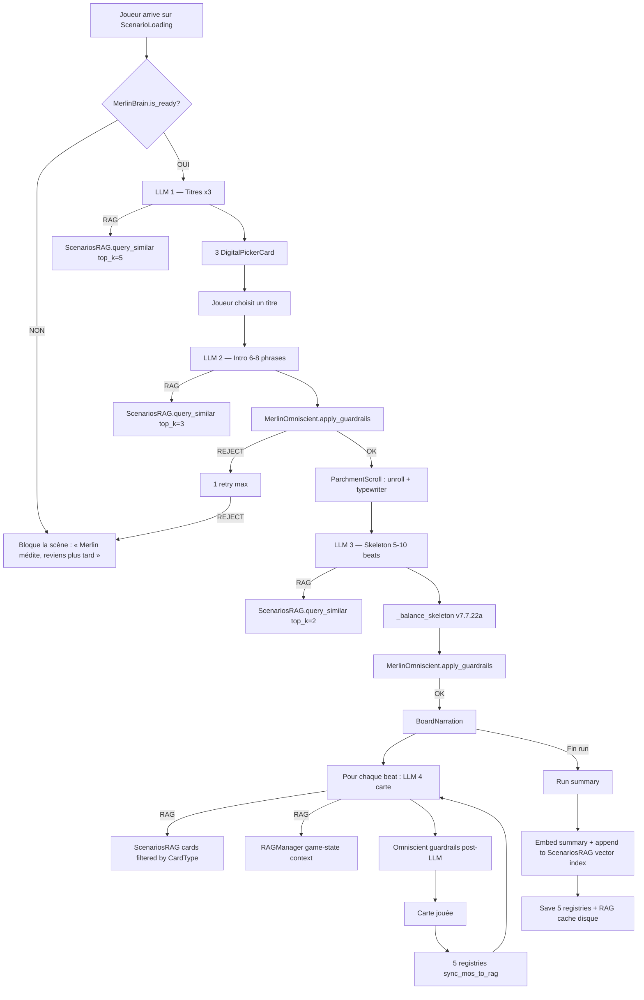

# GAME DESIGN BIBLE — M.E.R.L.I.N. v3.9

> **Source de verite unique** pour le game design de M.E.R.L.I.N.
> Supersede : GAME_DESIGN_BIBLE v2.4 + v3.0, MASTER_DOCUMENT.md, DOC_12, DOC_13, DOC_11
> Date de creation : 2026-03-12 | v3.0 : 2026-05-09 | v3.1 : 2026-05-16
> References : Inscryption (MJ adversarial, 4e mur) + AI Dungeon (liberte narrative IA) + **Hand of Fate 2** (no drain, equilibre via cartes)

## v3.5 Changelog (2026-05-16)

Reconciliation bible v3.0 ↔ code v7.7.3 via 15 questions AskUserQuestion. Decisions :

| Topic | v3.0 stale | v3.1 canon |
|---|---|---|
| Factions | "Reduit a 3 Poles" | **5 Factions confirmees** (druides/anciens/korrigans/niamh/ankou) |
| Rune-Circuits | 9 (bible) | **9 confirmees** (refacto Godot 18→9 a faire) |
| Drain de vie | -1 par carte auto | **SUPPRIME — HoF2-style, equilibre via card effects uniquement** |
| Pipeline | 12 etapes | **11 etapes** (drop DRAIN -1) |
| Acte structure | non specifie | **5 actes × 5 cartes = 25 cartes** (MOS target) |
| MOS HUD | non specifie | **Visible discret "Carte X/25" top-right** |
| Scene flow | DruidTable monolith | **Plateau-only v7.7.2 : MenuTest → BoardNarration (sub-scenes inline)** |
| Game over | vie=0 only | **vie=0 OR MOS hard_max(50) OR choix joueur** |
| Asset spawn | non specifie | **Module commun `asset_spawn_animator.gd` pattern unique** |
| Merlin voice | text only | **Speech-bar + TTS (use_my_voice)** pendant scenario writing |
| Card flip | non specifie | **Double-tap RotateY 180° pour scenarios longs** |
| Bible-first | non specifie | **Lecture obligatoire §1-§24 au debut de chaque session MERLIN** |
| AskUserQuestion | non specifie | **SIMPLE+ obligatoire, longues sessions MODERATE+** |
| Bible update | non specifie | **Per-feature complete (sync code ↔ bible)** |

---

## 1. Vision & Piliers

### 1.1 Pitch

M.E.R.L.I.N. est un **duel de cartes narratif** contre une IA adversariale meta-consciente, ancre dans la mythologie celtique de Broceliande. Le joueur affronte Merlin — un druide-IA qui sait qu'il est un programme, brise le 4e mur, et manipule les regles en fonction de sa relation avec le joueur. Chaque run est une conversation unique generee par un LLM local.

### 1.2 Piliers de design

| Pilier | Description |
|--------|-------------|
| **L'IA comme adversaire** | Merlin n'est pas un outil — c'est un personnage jouable qui reagit, commente, triche, et evolue. Le joueur le SENT. |
| **Conversation, pas menu** | Le jeu est une conversation continue avec Merlin. Les cartes sont des repliques, les choix des reponses. |
| **Fun first** | Chaque seconde de jeu doit etre engageante. Pas de filler, pas de marche vide, pas de systeme qu'on ignore. |
| **Roguelite profond** | Progression cross-run significative. Chaque run apprend quelque chose au joueur ET a Merlin. |

### 1.3 Core Loop — La Table du Druide

Le run se deroule sur une **table 2D** au premier plan, avec un **biome 3D anime en parallax** derriere. Plus de marche on-rails — le joueur est toujours en action.

```
+-------------------------------------------------------------------+
|                    BOUCLE D'UN RUN (~20 min)                       |
|                                                                    |
|  Hub 2D -> Choix biome -> Choix Rune-Circuit                      |
|         |                                                          |
|         v                                                          |
|  TABLE DU DRUIDE : table 2D + biome 3D parallax derriere          |
|         |                                                          |
|         v                                                          |
|  Merlin PARLE (commentaire, provocation, lore) [~3s]              |
|         |                                                          |
|         v                                                          |
|  3 Rune-Cartes glissent sur la table [~2s animation]              |
|         |                                                          |
|         v                                                          |
|  Joueur choisit une option (3 choix, parfois texte libre)         |
|         |                                                          |
|         v                                                          |
|  CHALLENGE (4 types, pas toujours un minigame)                    |
|         |                                                          |
|         v                                                          |
|  Consequences : effets + Merlin commente le resultat              |
|         |                                                          |
|         v                                                          |
|  [Repeter] ~15-25 cycles jusqu'a fin ou mort                      |
|         |                                                          |
|         v                                                          |
|  Fin -> Ecran de run -> Gains -> Hub                              |
+-------------------------------------------------------------------+
```

**Cycle cible** : ~20 secondes par carte (Merlin parle 3s + choix 5s + challenge 8s + consequences 4s). Un run de 20 cartes = ~7 minutes. Rapide, dense, rejouable.

**Principes cles** :
- **Zero temps mort** : le joueur est toujours en train de lire, choisir, ou jouer
- **Merlin est omnipresent** : il commente chaque action, provoque, felicite, ou triche
- **Le fond 3D vit** : le biome s'anime, reagit aux choix (orage apres un echec, lumiere apres un succes)
- **Pas de skip** : chaque challenge est court (5-12s) et varie

### 1.4 Meta Loop (entre les runs)

```
[Fin de run] -> Gains : Anam + Grimoire entries
       |
[Hub 2D / Antre] -> Merlin debriefe (LLM, base sur le run)
       |
[Grimoire] -> Consulter progres, Rune-Circuits, lore decouvert
       |
[Choisir biome] -> Debloque via score de maturite
       |
[Nouveau run] -> Merlin se souvient du joueur
```

---

## 2. Merlin — L'IA adversariale

### 2.1 Personnalite

Merlin est le personnage central. Il est :
- **Meta-conscient** : il sait qu'il est une IA, un programme, un modele de langage
- **Adversarial** : il joue CONTRE le joueur (mais pas toujours — la confiance change la donne)
- **Manipulateur** : il peut modifier les cartes, cacher des effets, mentir sur les options
- **4e mur** : il commente le jeu lui-meme ("Tu vas encore choisir l'option de gauche, n'est-ce pas ?")
- **Memorable** : il a des catch-phrases, des humeurs, des preferences qu'il developpe au fil des runs

### 2.2 Confiance Merlin (T0-T3)

La relation joueur-Merlin est le coeur du meta-game.

| Tier | Seuil | Comportement | Interferences | Ce qu'il revele |
|------|:---:|--------------|:---:|-----------------|
| **T0** | 0-24 | Hostile, cryptique | 3 slots | Rien — enigmes, mensonges, pieges |
| **T1** | 25-49 | Meprisant, indices | 2 slots | Quelques indices sur les effets |
| **T2** | 50-74 | Respectueux, fair-play | 1 slot | Avertit des dangers, aide parfois |
| **T3** | 75-100 | Complice, genereux | 0 slots | Secrets, raccourcis, fins cachees |

**Persistance** : cross-run. Depart a 0 (T0).
**Bornes** : 0-100, clamp. Changement de tier **immediat** mid-run.

| Action | Impact confiance |
|--------|:---:|
| Promesse tenue | +10 |
| Promesse brisee | -15 |
| Choix courageux / altruiste | +3 a +5 |
| Choix egoiste / destructeur | -3 a -5 |
| Gagner un Rune Gambit | +2 |
| Tricher (detecte par Merlin) | -10 |

### 2.3 Systeme d'interferences

Merlin peut **manipuler** les cartes en fonction de son tier de confiance. Plus la confiance est basse, plus il triche.

| Interference | Description | Tier requis |
|-------------|-------------|:-----------:|
| **Swap** | Echange secretement 2 options (effets inverses) | T0 uniquement |
| **Hide** | Masque les effets d'1 option (affiche "???") | T0, T1 |
| **Amplify** | Augmente un effet negatif de x1.5 | T0, T1 |
| **Bait** | Rend une mauvaise option visuellement attractive | T0 |
| **Hint** | Revele un indice sur la meilleure option (aide) | T2, T3 |
| **Gift** | Ajoute un bonus cache a une option | T3 uniquement |

**Slots d'interference par tour** : T0 = 3, T1 = 2, T2 = 1, T3 = 0.
**Le joueur peut detecter** certaines interferences via les Rune-Circuits (cf. section 3).
**Merlin annonce parfois** ses interferences a posteriori ("Tu as vu ? J'ai inverse les deux options. Tu aurais du me faire confiance.").

### 2.4 Commentaires de Merlin (LLM-driven)

Merlin commente CHAQUE action du joueur. Ses commentaires sont generes par le LLM.

| Moment | Type de commentaire | Exemple |
|--------|-------------------|---------|
| Avant les cartes | Provocation, contexte | "Encore Broceliande ? Tu es previsible." |
| Apres un choix | Reaction | "Interessant... tu oses defier les Anciens." |
| Apres un challenge | Jugement | "Score mediocre. Je m'attendais a mieux de toi." |
| Apres un echec | Moquerie ou pitie | "C'est la 3e fois que tu meurs ici. Fascinant." |
| Debut de run | Souvenir cross-run | "La derniere fois, tu as brise ta promesse. Je m'en souviens." |
| T3 special | Complicite | "Entre nous... prends l'option du milieu. Fais-moi confiance." |

---

## 3. Rune-Circuits (ex-Oghams) — 9 pouvoirs

### 3.1 Simplification v2.4 -> v3.0

18 Oghams -> **9 Rune-Circuits** organises en 3 Poles.

### 3.2 Les 3 Poles (ex-Factions)

5 factions -> **3 Poles** (reduction de la surcharge cognitive).

| Pole | Theme | Fusions v2.4 | Couleur |
|------|-------|-------------|---------|
| **Ordre** | Loi, traditions, structure | Druides + Anciens | Or / Ambre |
| **Chaos** | Malice, creativite, imprevu | Korrigans + Ankou | Violet / Feu |
| **Liminal** | Frontiere, equilibre, passage | Niamh (entre-deux) | Cyan / Brume |

**Echelle** : 0-100 par Pole. Cross-run, sans decay.
**Seuils** : 50 = cartes speciales du Pole. 80 = fin narrative du Pole.
**Cross-Pole** : ~10% des cartes creent des trade-offs (aider Ordre = -rep Chaos).

### 3.3 Catalogue des 9 Rune-Circuits

| # | Cle | Nom | Pole | Effet | CD | Anam |
|---|-----|-----|------|-------|:---:|:---:|
| 1 | `beith` | Bouleau-Circuit | Neutre | Revele l'effet d'**1 option** | 3 | 0 (starter) |
| 2 | `luis` | Sorbier-Bouclier | Neutre | Bloque le **prochain effet negatif** | 4 | 0 (starter) |
| 3 | `quert` | Pommier-Restaure | Neutre | Soin **+10 PV** | 4 | 0 (starter) |
| 4 | `duir` | Chene-Amplificateur | Ordre | Double les effets positifs de l'option choisie | 5 | 80 |
| 5 | `nuin` | Frene-Reforge | Ordre | Remplace la pire option par une nouvelle (LLM) | 6 | 100 |
| 6 | `straif` | Prunellier-Twist | Chaos | Force un **retournement narratif** dans la carte suivante | 8 | 120 |
| 7 | `muin` | Vigne-Inversion | Chaos | **Inverse** positifs/negatifs de l'option choisie | 7 | 100 |
| 8 | `saille` | Saule-Detection | Liminal | Revele les **interferences actives** de Merlin | 5 | 90 |
| 9 | `ioho` | If-Annulation | Liminal | **Defausse** la carte et en genere une nouvelle (LLM) | 10 | 140 |

**3 starters** debloques des le debut : beith, luis, quert (tier 0, cout 0).

### 3.4 Regles d'utilisation

- Le joueur **equipe 1 Rune-Circuit** au debut du run
- Pendant un run, il peut **trouver 1 Rune-Circuit supplementaire**
- **1 seul actif** a la fois (switch possible entre les cartes)
- Activation **uniquement pendant l'affichage de la carte** (avant choix)
- **1 activation par carte** max
- Cooldown diminue de 1 par **carte jouee** (pas en temps reel)
- Rune-Circuit deja possede trouve en run = **+5 Anam**
- **Saille** (Detection) est unique : permet de voir si Merlin a manipule les options

---

## 4. Challenges — 4 types

### 4.1 Remplacement des minigames obligatoires

v2.4 : 14 minigames obligatoires a chaque carte.
v3.0 : **4 types de challenges** avec des poids differents. Le joueur ne fait pas toujours un minigame.

| Type | Poids | Description | Duree |
|------|:---:|-------------|:---:|
| **Rune Gambit** | 35% | Duel strategique rapide contre Merlin | 5-8s |
| **Minigame** | 30% | Epreuve d'adresse/reflexe (simplifie) | 8-12s |
| **Oracle Reading** | 20% | Interpretation/deduction (LLM juge) | 10-15s |
| **Merlin Judges** | 15% | Pas de gameplay — Merlin decide | 2-3s |

### 4.2 Rune Gambit (35%)

Duel de runes contre Merlin : le joueur et Merlin posent chacun une rune-symbole. Le resultat depend du match-up (type pierre-papier-ciseaux etendu).

```
Joueur pose une rune -> Merlin repond -> Resolution
```

- 5 symboles : Chene (force), Saule (flux), Pierre (resistance), Feu (destruction), Brume (evasion)
- Chene > Saule > Pierre > Feu > Brume > Chene
- **Merlin triche** a T0-T1 : il voit la rune du joueur avant de poser la sienne (30% du temps)
- Score : victoire = 80, egalite = 50, defaite = 20

### 4.3 Minigames (30%) — 6 types simplifies

Reduit de 14 a **6 minigames**. Chacun est court, visuel, et satisfaisant.

| Minigame | Description | Input | Duree |
|----------|-------------|-------|:---:|
| **Rune-Hacking** | Tracer le bon symbole ogham sur l'ecran | Tactile/souris | 8s |
| **Fil de Mana** | Guider un flux lumineux dans un circuit | Mouvement | 10s |
| **Equilibre** | Maintenir un curseur centre malgre les perturbations | Stabilisation | 8s |
| **Sequence** | Memoriser et reproduire une sequence de runes | Memoire | 12s |
| **Reflexe** | Cliquer sur les runes qui apparaissent (eviter les pieges) | Timing | 8s |
| **Negociation** | Slider de tension : trouver le point d'equilibre | Precision | 10s |

Score 0-100 -> effets proportionnels.

### 4.4 Oracle Reading (20%)

Le joueur interprete un "tirage" de symboles. Le LLM genere un puzzle visuel et le joueur donne une reponse (choix parmi 3 interpretations). Le LLM juge la pertinence.

- 3 interpretations proposees (LLM-generated)
- Le joueur choisit celle qui lui semble la plus coherente avec le contexte
- Le LLM evalue et score (0-100)
- **Pas de bonne reponse absolue** — c'est subjectif et dependant du contexte narratif

### 4.5 Merlin Judges (15%)

Pas de gameplay. Merlin observe le choix du joueur et decide seul du resultat. Son jugement depend de :
- Le tier de confiance (T0 = hostile, T3 = genereux)
- L'historique du joueur (coherence des choix)
- L'humeur de Merlin (variable LLM)

Score attribue par Merlin : 20-80 (jamais extremes sauf T3).

### 4.6 Resultat des challenges

| Score | Label | Multiplicateur |
|-------|-------|:--------------:|
| 0-20 | Echec critique | Negatifs x1.5 |
| 21-50 | Echec | Negatifs x1.0 |
| 51-79 | Reussite partielle | Positifs x0.5 |
| 80-94 | Reussite | Positifs x1.0 |
| 95-100 | Reussite critique | Positifs x1.5 + bonus |

---

## 5. Systemes de jeu

### 5.1 Vie (barre unique) — v3.1 HoF2-style, NO DRAIN

| Parametre | Valeur |
|-----------|--------|
| Maximum | 100 |
| Depart | 100 |
| Drain de base | **0 (SUPPRIME v3.1)** — equilibre via card effects uniquement |
| Degats echec critique | -10 |
| Degats challenge rate | -3 a -8 (via card effects) |
| Soin succes critique | +5 |
| Soin succes standard | +2 a +4 (via card effects) |
| Soin repos | +18 (carte repos rare) |
| Seuil alerte UI | 25 |
| A 0 | Fin de run (narration, pas "game over") |
| Verification mort | **Apres** tous les effets de la carte |

**Philosophie HoF2** (v3.1) : la tension ne vient PAS de la pression temporelle (drain auto) mais des **choix** du joueur. Chaque option de carte porte ses propres effects. Le joueur peut theoriquement survivre 50 cartes en jouant safe — mais la pression vient de la **diversite limitee des choix safes** (le LLM/FastRoute peut imposer 3 options dont aucune n'est confortable).

**Game over conditions (v3.1)** : `vie = 0` OU `MOS hard_max (50 cartes)` OU `choix joueur abandon`.

### 5.2 Monnaies

#### Anam (cross-run)

| Propriete | Detail |
|-----------|--------|
| Persistance | Cross-run (permanente) |
| Sources | Fin de run, challenges reussis, Rune-Circuits utilises |
| Usage | Debloquer Rune-Circuits + entrees Grimoire |

| Source | Anam |
|--------|:---:|
| Base par run | 10 |
| Bonus victoire | +15 |
| Challenge reussi (score >= 80) | +2 |
| Rune-Circuit utilise | +1 |
| Pole honore (rep >= 80) | +5 |

**Mort/abandon** : `Anam x min(cartes/30, 1.0)`.

#### Essence (per-run)

Remplace la monnaie biome. Universelle, pas specifique au biome.

| Propriete | Detail |
|-----------|--------|
| Persistance | Per-run uniquement |
| Sources | Recompenses de challenges, cartes bonus |
| Usage | Achats marchands, boost challenge, offrandes |

### 5.3 Pipeline d'effets (ordre strict) — v3.1 11 etapes

```
1. CARTE affichee (Merlin commentary opt., 1-line LLM intro)
2. RUNE-CIRCUIT? (activation optionnelle, avant choix)
3. CHOIX du joueur (3 options + flip si scenario long)
4. CHALLENGE (4 types : lexical, dice, skill, choice)
5. SCORE 0-100
6. EFFETS appliques (multiplies par score, capped x2.0)
7. PROTECTION (Rune-Circuits actifs, shields, etc.)
8. VIE = 0? (verification mort APRES tous les effets)
9. PROMESSES (check delais, expiration)
10. MERLIN COMMENTE (LLM, faction-aware via echo_memory)
11. CARTE SUIVANTE (MOS cards++ + verification hard_max 50)
```

**v3.1 change** : etape 1 `DRAIN -1` SUPPRIMEE (HoF2 philosophy). La carte commence directement par son affichage + commentaire Merlin optionnel.

### 5.4 Effets autorises (whitelist)

| Effet | Format | Cap/carte |
|-------|--------|:---------:|
| `ADD_REPUTATION` | pole + amount | +/-20 |
| `HEAL_LIFE` | amount | +18 max |
| `DAMAGE_LIFE` | amount | -15 max (-22 critique) |
| `ADD_ESSENCE` | amount | +10 max |
| `ADD_TAG` | tag_name | - |
| `REMOVE_TAG` | tag_name | - |
| `PROMISE` | promise_id | - |
| `PLAY_SFX` | sound_id | - |
| Total effets/option | - | 3 max |

### 5.5 Promesses / Quetes

Les cartes Promesse creent des engagements avec countdown :
- Delai : X cartes (variable, MOS decide)
- Max 2 actives simultanement
- Tenir = +rep Pole +10 confiance, briser = -rep Pole -15 confiance

---

## 6. Structure d'un run

### 6.1 Demarrage

1. Joueur choisit un **biome** dans le Hub
2. Choix du **Rune-Circuit** equipe
3. LLM genere la **trame** pendant le chargement (prefetch)
4. **Table du Druide** apparait : fond 3D + table 2D
5. Merlin se manifeste, le run commence

#### Premier run (onboarding)

- Biome force : Broceliande
- 2-3 premieres cartes scriptees (pas LLM)
- Merlin explique la vie, les choix, les challenges
- A partir de la carte 4, LLM prend le relais
- Pas de Rune Gambit ni Merlin Judges pendant le tuto

### 6.2 Types de cartes

| Type | Poids | Description | Challenge ? |
|------|:---:|-------------|:-----------:|
| Narrative | 75% | Choix standard (3 options) | Oui (4 types) |
| Evenement | 10% | Evenement contextuel | Oui |
| Promesse | 5% | Quete avec delai | Oui |
| Merlin Direct | 10% | Merlin parle (pas de challenge) | **Non** |

**Merlin Direct** est a 10% (vs 5% en v2.4) car ces moments sont les plus IA-driven et les plus memorables.

### 6.3 Carte — structure JSON

```json
{
  "text": "Texte narratif (LLM Narrator)",
  "speaker": "Merlin | NPC",
  "options": [
    {"label": "Texte d'action", "effects": [{"type": "...", "amount": 0}]},
    {"label": "Texte d'action", "effects": [{"type": "...", "amount": 0}]},
    {"label": "Texte d'action", "effects": [{"type": "...", "amount": 0}]}
  ],
  "type": "narrative | event | promise | merlin_direct",
  "challenge_type": "rune_gambit | minigame | oracle | merlin_judges",
  "interference": "swap | hide | amplify | bait | hint | gift | null",
  "merlin_comment": "Commentaire genere par LLM",
  "tags": []
}
```

### 6.4 MOS — Merlin Omniscient System

Le MOS reste le cerveau central (architecture inchangee depuis v2.4).

#### Convergence

- Soft min : **8 cartes**
- Target : **15-20 cartes** (reduit de 20-25 — runs plus rapides)
- Soft max : **30 cartes** (reduit de 40)
- Hard max : **40 cartes** (reduit de 50)

#### Registres

1. **Player Registry** — comportement, tendances
2. **Narrative Registry** — arcs, PNJ, twists
3. **Pole Registry** — reputations (3 Poles)
4. **Card Registry** — cartes jouees, fatigue thematique
5. **Promise Registry** — promesses actives
6. **Trust Registry** — confiance Merlin T0-T3
7. **Interference Registry** (NOUVEAU) — historique des manipulations de Merlin

### 6.5 Input libre (Merlin Direct)

Aux moments Merlin Direct (~10% des cartes), le joueur peut ecrire du **texte libre** (max 80 caracteres) au lieu de choisir parmi 3 options. Le LLM interprete la reponse et genere les consequences.

**Garde-fous** :
- Filtrage contenu (pas d'anglais, pas de hors-sujet)
- Fallback sur 3 options si le texte est invalide
- Max 80 caracteres

### 6.6 Interruption / Resume

Identique a v2.4 : sauvegarde complete de l'etat du run + resume JSON pour le LLM.

---

## 7. Biomes — Mondes celtiques

### 7.1 Biomes

| # | Biome | Pole dominant | Ambiance cyber-druidique |
|---|-------|:---:|----------|
| 1 | **Foret de Broceliande** | Liminal | Arbres-circuits, brume numerique, murmures de code |
| 2 | Landes de Bruyere | Ordre | Horizons infinis, monolithes de donnees |
| 3 | Cotes Sauvages | Liminal | Maree de bits, phares holographiques |
| 4 | Villages Celtes | Ordre | Architecture organique-digitale |
| 5 | Cercles de Pierres | Liminal | Menhirs-serveurs, solstice algorithmique |
| 6 | Marais des Korrigans | Chaos | Feux follets = bugs lumineux, brouillard de static |
| 7 | Collines aux Dolmens | Ordre | Dolmens-antennes, echos ancestraux |
| 8 | Iles Mystiques | Chaos | Fragmentees, glitch spatial, data corruption |

**Demo scope** : Foret de Broceliande uniquement. Les autres arrivent apres validation de la boucle complete.

### 7.2 Score de maturite

Formule : `runs x 2 + fins x 5 + runes x 3 + max_pole_rep x 1`

| Biome | Seuil |
|-------|:---:|
| Landes / Cotes | 15 |
| Villages | 25 |
| Cercles | 30 |
| Marais | 40 |
| Collines | 50 |
| Iles | 75 |

### 7.3 Arcs narratifs par biome

Chaque biome a **1 arc exclusif** (3-5 cartes, multi-runs) + l'arc cross-biome "Le Murmure des Oghams".

---

## 8. Progression meta

### 8.1 Grimoire (ex-Arbre de talents)

Le Grimoire remplace l'arbre de talents. C'est un **livre interactif** que le joueur remplit au fil des runs.

| Section | Contenu | Source |
|---------|---------|--------|
| **Rune-Circuits** | Deblocage des 9 Rune-Circuits | Achat avec Anam |
| **Bestiaire** | Creatures et PNJ rencontres | Decouverte en run |
| **Codex** | Lore sur les biomes, les Poles, Merlin | Fins debloquees + exploration |
| **Journal de Merlin** | Ce que Merlin pense du joueur (LLM cross-run) | Auto-genere |

### 8.2 Cout des Rune-Circuits

| Tier | Cout Anam | Runs pour debloquer |
|------|:---------:|:-------------------:|
| Starter (x3) | 0 | 0 |
| Tier 1 (x3) | 80-100 | ~8-10 runs |
| Tier 2 (x3) | 120-140 | ~12-14 runs |

### 8.3 Fins multiples

- Si 2+ Poles >= 80 : le **joueur choisit** quelle fin debloquer
- Verification **en fin de run** (pas en temps reel)
- Chaque Pole a sa fin + 1 fin "Transcendance" (arc cross-biome complet)

---

## 9. Architecture LLM — Cerveau de M.E.R.L.I.N. (v7.7.24 cartography)

Le cerveau de MERLIN est une pile à 4 LLM coordonnée par un orchestrateur central (`MerlinOmniscient`) avec deux index RAG (`RAGManager` pour l'état de jeu + `ScenariosRAG` pour les 100 références hand-crafted), un système de garde-fous multi-tier, et une persistance cross-run.

**Principe directeur (v7.7.24)** : *jamais d'output LLM sans contexte injecté, jamais d'output non-vérifié par les guardrails, jamais de degradation silencieuse — si le cerveau n'est pas opérationnel, la scène bloque avec un message clair au joueur*.

### 9.0 Vue d'ensemble — pipeline complet



### 9.1 Les 4 LLM du pipeline (v7.7.23+)

| LLM | Quand | Modèle | RAG injecté | Guardrails | Latence cible |
|---|---|---|---|---|:---:|
| **1. Titres** | Au démarrage de ScenarioLoading | Narrator (Qwen 3.5 4B) | 5 titres de référence (ScenariosRAG kNN cosine) | Forbidden words + longueur ≤ 60 char | <8s |
| **2. Intro** | Après pick du titre | Narrator | 3 intros de référence (ScenariosRAG) + 5 registries | Forbidden words + ≥ 5 phrases + Jaccard < 0.5 vs references | <10s |
| **3. Skeleton** | Pendant parchemin | Game Master (Qwen 3.5 2B) | 2 beat-sequences de référence + biome bias | GBNF + `_balance_skeleton` + Jaccard | <15s |
| **4. Cartes (per-beat)** | À chaque beat in run | GM + Narrator (pipeline bi-brain) | 2 cartes de référence filtrées par CardType + RAGManager context | GBNF + forbidden words + 4e mur check | <2s prefetch |

### 9.2 Multi-Brain hardware (modèles + RAM)

| Cerveau | Modèle | RAM | Rôle | Temperature |
|---|---|:---:|---|:---:|
| **Narrator** | Qwen 3.5 4B + LoRA `merlin-narrator` | ~3.2 GB | Prose riche, voix de Merlin, intros, titres | 0.70 |
| **Game Master** | Qwen 3.5 2B | ~1.8 GB | JSON skeleton, JSON cartes, effets, jugements | 0.15 |
| **Embedder** | nomic-embed-text | 137 MB | 768-dim vectors pour ScenariosRAG kNN | — |

Profils hardware : NANO (4 GB, 1 brain time-sharing) / SINGLE (6 GB, 4B narrator + 2B GM tour à tour) / DUAL (8+ GB, simultané) / QUAD (16+ GB).

### 9.3 RAG — DEUX indices coordonnés

#### 9.3.1 `RAGManager` — état de jeu (game-state RAG)
Source : `addons/merlin_ai/rag_manager.gd`. Indexe l'état runtime du joueur :
- 5 registries persistantes (PlayerProfile / DecisionHistory / Relationship / Narrative / Session)
- Game journal max 100 entries (card_played / choice_made / effect_applied / ogham_used / run_event)
- Cross-run memory max 20 summaries (runs précédents)
- 12 sections priorisées : crise, scene contract, narrative récente, arcs actifs, biome, ton, profil, promesses, interférences, karma, tension, recent_played
- Budget par cerveau : Narrator 800 tokens / GM 400 / Judge 200

#### 9.3.2 `ScenariosRAG` — contenu de référence (reference RAG, v7.7.23)
Source : `addons/merlin_ai/scenarios_rag.gd` (autoload `/root/ScenariosRAG`).
- 100 scénarios Brocéliande hand-crafted (`data/ai/scenarios_reference_broceliande.json`, 3.46 MB)
- 100 vectors 768-dim pré-calculés via Ollama `nomic-embed-text` (`data/ai/scenarios_reference_broceliande.embeddings.json`, 1.6 MB)
- API : `query_similar(text, top_k, biome_filter)` retourne top-K matches par cosine kNN
- LRU cache 50 query embeddings (évite re-embedding du même prompt)
- Fallback gracieux : si Ollama embed down → keyword-archetype matching
- 4 formatters : `format_titles_as_few_shot` / `format_intros_as_few_shot` / `format_skeleton_as_few_shot` / `format_cards_as_few_shot`

#### 9.3.3 Coordination des deux RAGs
Les deux RAGs sont **complémentaires** et **toujours appelés en même temps** :
- `ScenariosRAG` fournit le **style** et la **qualité d'écriture** (few-shot examples)
- `RAGManager` fournit le **contexte joueur** et la **continuité narrative**
- Chaque LLM call combine les deux dans son system prompt

### 9.4 Garde-fous — orchestration centralisée par MerlinOmniscient (v7.7.24)

Source : `addons/merlin_ai/merlin_omniscient.gd` `apply_guardrails(text)` lines 1524-1610.

#### 9.4.1 Niveaux de garde-fous

| Tier | Quand | Comportement |
|---|---|---|
| **HARD** | Forbidden words (cf §9.4.2), 4e mur (« simulation », « IA », « programme »), longueur min/max | REJECT + 1 retry max → si retry fail : BLOCK la scène |
| **SOFT** | Jaccard similarity vs derniers outputs > 0.5 (répétition) | WARN + retry → 2ème retry accepté même si répétitif |
| **SUGGEST** | Faction tilt drift (faction emergente ≠ attendue) | LOG dans le journal RAG, output accepté |

#### 9.4.2 Liste des forbidden words (canon)
Source : `data/ai/config/merlin_persona.json` + `docs/50_lore/NARRATIVE_GUARDRAILS.md`.

Termes bannis (whole-word case-insensitive matching) :
- *fin du monde*, *simulation*, *IA*, *programme*, *serveur*, *sauvegarde* (rupture 4e mur)
- *spawn*, *loot*, *hub*, *level*, *boss* (anglicismes jeu vidéo)
- *neon*, *cyber*, *circuit*, *code*, *data*, *pixel*, *glitch* (cyber dans la prose narrative — autorisés dans le visuel §10)
- *system*, *interface*, *build* (jargon moderne)
- Toute mention d'une marque commerciale moderne

#### 9.4.3 Indirection autorisée (canon lore)
- *le dehors est silencieux* (au lieu de « pas de réseau »)
- *la lande se souvient* (au lieu de « la save persiste »)
- *Merlin observe une étrange régularité* (au lieu de « bug détecté »)

### 9.5 Persistance — toutes les couches (v7.7.24)

#### 9.5.1 5 registries persistantes (game-state)
Source : `scripts/merlin/merlin_save_system.gd` + `merlin_omniscient.gd::save_all()`.
- PlayerProfile, DecisionHistory, Relationship, Narrative, Session
- Auto-save à chaque major action (card_played, run_completed)
- Format : JSON dans `user://merlin_save.json` (profil unique)

#### 9.5.2 Cross-run memory (RAG)
- Max 20 résumés de runs passés
- Chaque résumé inclut : run_id, ending, dominant_faction, player_style, key_decisions
- Injectés dans `RAGManager.get_prioritized_context` pour TOUS les LLM calls subséquents

#### 9.5.3 ScenariosRAG incremental learning (v7.7.24 NEW)
À la fin de chaque run, le résumé du run est :
1. Embedé via Ollama nomic-embed-text → vector 768-dim
2. Ajouté à l'index `_embeddings` en mémoire
3. Sauvegardé sur disque (`user://scenarios_rag_learned.json`) pour persistance cross-session
4. Re-loadé au `_ready` suivant et fusionné avec l'index hand-crafted de base

Effet : le LLM du jeu apprend progressivement le style propre du joueur à travers ses runs.

#### 9.5.4 LRU query cache disque (v7.7.24 NEW)
ScenariosRAG.query_cache (50 entries en mémoire) est sérialisé à `user://scenarios_rag_query_cache.json` au save → restauré au boot → évite re-embedding entre sessions pour les requêtes courantes.

### 9.6 Stricte disponibilité — pas de fallback silencieux (v7.7.24)

Décision utilisateur lock : *« si LLM down, on bloque ».*

Pre-scene check :
```gdscript
if not MerlinAI.is_brain_ready():
    _show_brain_offline_message("Merlin médite. Reviens dans quelques instants.")
    return _back_to_hub()
```

Cette stricte exigence remplace les anciens fallbacks gracieux (`_fallback_titles` etc. restent disponibles mais ne sont déclenchés QUE par les guardrails post-LLM, jamais par défaut en l'absence d'Ollama).

### 9.7 Contrat Narrator (v7.7 — préservé)
- `text` : 1-4 phrases en français celtique
- `speaker` : "Merlin" ou NPC nommé
- `options` : **toujours 3 options**, verbe d'action infinitif
- `merlin_comment` : commentaire de Merlin sur la situation, italique
- Voix Merlin : *italique légère, ton druidique, présent, questions plutôt que réponses*

### 9.8 Contrat GM (v7.7 — préservé + v7.7.22a balance)
- JSON d'effets par option (whitelist : DAMAGE_LIFE / HEAL_LIFE / ADD_REPUTATION / ADD_ANAM)
- Caps : ±20 par faction/carte
- Field `interference` (type + justification)
- v7.7.22a : `rarity` / `pole` / `card_type` fields per beat, balanced via `_balance_skeleton`

### 9.9 Prefetch total — Le joueur ne doit JAMAIS attendre

```
Pendant que le joueur joue la carte N :
  -> Narrator génère la carte N+1 en arrière-plan
  -> GM pré-calcule les effets + interférences
  -> Commentaire Merlin pendant l'animation de résolution
```

Couplé au cache LRU ScenariosRAG : ~80% des prompts identiques entre runs courts atteignent le cache → 0ms d'embed sur ces requêtes.

### 9.10 6 Points d'intégration LLM (mapping fonctionnel)

| Point | Quand | LLM | Cerveau | Latence |
|---|---|:---:|---|:---:|
| 1. Titres scénarios | ScenarioLoading boot | LLM 1 | Narrator | <8s |
| 2. Intro lore | Post title-pick | LLM 2 | Narrator | <10s |
| 3. Skeleton scénario | Pendant parchemin | LLM 3 | GM | <15s |
| 4. Cartes per-beat | Pendant le run | LLM 4 | GM + Narrator | prefetch |
| 5. Commentaire Merlin | Après action joueur | LLM 4 follow-up | Narrator | <2s |
| 6. Debrief fin de run | Hub post-run | LLM 4 variant | Narrator | <4s |

### 9.11 Reference files — où trouver quoi

| Composant | Fichier | Rôle |
|---|---|---|
| Façade LLM HTTP | `addons/merlin_ai/merlin_ai.gd` | `generate_with_system`, `is_brain_ready()` (v7.7.24) |
| Orchestrateur central + guardrails | `addons/merlin_ai/merlin_omniscient.gd` | `apply_guardrails`, sync registries, route stratégies |
| Game-state RAG | `addons/merlin_ai/rag_manager.gd` | 12 sections priorisées, budgets per-brain |
| Reference RAG (v7.7.23) | `addons/merlin_ai/scenarios_rag.gd` | kNN cosine sur 100 références |
| Pipeline scénario | `addons/merlin_ai/scenario_planner.gd` | titles / intro / skeleton + `_balance_skeleton` |
| Pipeline cartes | `addons/merlin_ai/bi_brain_pipeline.gd` | GM brain + Narrator brain wrap |
| Persona config | `data/ai/config/merlin_persona.json` | forbidden words, persona few-shots |
| Reference data | `data/ai/scenarios_reference_broceliande.json` | 100 scénarios canon |
| Reference embeddings | `data/ai/scenarios_reference_broceliande.embeddings.json` | 768-dim vectors |
| Cross-run RAG learned | `user://scenarios_rag_learned.json` (v7.7.24) | run summaries embedded |
| Save state | `user://merlin_save.json` | 5 registries persistantes |
| GBNF grammars | `data/ai/*.gbnf` | scenario_skeleton, merlin_card, gamemaster_choices, gamemaster_effects |
| Narrative guardrails canon | `docs/50_lore/NARRATIVE_GUARDRAILS.md` | indirections autorisées, voix de Merlin |
| LLM architecture détaillé | `docs/LLM_ARCHITECTURE.md` | v3.0 → v7.7.24 versionned |

---

## 10. Direction artistique — Cyber-Druidique

### 10.1 Concept

Fusion totale entre mythologie celtique et esthetique IA/tech :
- **Runes = circuits imprimes** (PCB traces qui forment des symboles ogham)
- **Foret = reseau neuronal** (branches = connexions, feuilles = data)
- **Magie = computation** (sorts = requetes, enchantements = compilations)
- **Merlin = processeur ancestral** (barbe = cables, yeux = ecrans, baton = antenne)

### 10.2 Palette

| Zone | Couleur | Hex | Usage |
|------|---------|-----|-------|
| Fond terminal | Noir profond | #0A0A12 | Background par defaut |
| Texte principal | Vert terminal | #00FF88 | Texte narratif, labels |
| Accent chaud | Ambre druide | #FFB347 | Highlights, or, feu |
| Accent froid | Cyan liminal | #00D4FF | Eau, brume, passage |
| Danger | Rouge rune | #FF3366 | Degats, alertes |
| Rare/special | Violet chaos | #9B59FF | Korrigans, chaos, magie |
| Neutre/UI | Gris pierre | #3A3A4A | Bordures, separateurs |

### 10.3 Elements visuels

| Element | Style |
|---------|-------|
| **Table du Druide** | Bois ancien avec circuits incrustes, traces lumineuses |
| **Cartes** | Parchemin-ecran, texte en police monospace, bordures rune-circuit |
| **Merlin** | Silhouette encapuchonnee, yeux brillants, sprite anime 2D |
| **Fond 3D** | Low-poly stylise, shader CRT optionnel, parallax 3 couches |
| **Rune-Circuits** | Icones vectorielles (SVG) avec glow anime |
| **HUD** | Terminal-style, minimaliste, vert sur noir |

### 10.4 Shaders existants

| Shader | Fichier | Usage v3.0 |
|--------|---------|-----------|
| CRT Terminal | `shaders/crt_terminal.gdshader` | Overlay HUD optionnel |
| Whisper Glitch | `shaders/whisper_glitch.gdshader` | Interferences de Merlin |
| Palette Swap | `shaders/palette_swap.gdshader` | Changement de biome |
| Iridescent Border | `shaders/iridescent_border.gdshader` | Bordures cartes rares |
| Pixelate | `shaders/pixelate.gdshader` | Transitions de scene |

### 10.5 Typographie

- **Narratif** : Police serif fantasy (Almendra, MedievalSharp)
- **UI/HUD** : Monospace (JetBrains Mono, Fira Code)
- **Merlin** : Italique legere, couleur variable selon tier

---

## 11. HUD & UI

### 11.1 Table du Druide (ecran principal)

```
+------------------------------------------------------------------+
|                    [BIOME 3D PARALLAX]                             |
|                    (arriere-plan anime)                            |
|                                                                    |
|  +--------------------------------------------------------------+ |
|  |                                                                | |
|  |  [Merlin sprite]  "Texte de Merlin..."           [PV ####--]  | |
|  |                                                                | |
|  |  +--------+  +--------+  +--------+                           | |
|  |  | CARTE  |  | CARTE  |  | CARTE  |                           | |
|  |  | Opt 1  |  | Opt 2  |  | Opt 3  |                           | |
|  |  +--------+  +--------+  +--------+                           | |
|  |                                                                | |
|  |  [Rune: Beith]  [Promesse 1/2]  [Essence: 12]  [Carte #7]    | |
|  +--------------------------------------------------------------+ |
+------------------------------------------------------------------+
```

### 11.2 Elements HUD

| Element | Position | Info |
|---------|----------|------|
| Vie | Haut-droit | Barre + chiffre |
| Rune-Circuit actif | Bas-gauche | Icone + cooldown |
| Promesses | Bas-centre | Icones + countdown |
| Essence | Bas-droit | Chiffre |
| Merlin | Gauche | Sprite + bulle |
| Carte # | Haut-gauche | Numero dans le run |

---

## 12. Audio

### 12.1 Musique

| Contexte | Style |
|----------|-------|
| Hub | Ambient celtique + drones electroniques |
| Run (Table) | Tension progressive, layers dynamiques |
| Challenge | Montee en intensite rapide |
| Fin victoire | Triomphant, harpe + synthwave |
| Fin mort | Sombre, reverb, decroissance |

### 12.2 SFX (SFXManager existant, 30+ sons)

Sons additionnels v3.0 :
- Carte glissee sur la table
- Interference Merlin (glitch audio)
- Rune-Circuit active (charge electrique + rune)
- Rune Gambit (pose de rune, resolution)

---

## 13. Tutoriel & Onboarding

### 13.1 Premier run (scripte)

| Carte | Enseignement |
|:---:|-------------|
| 1 | Merlin se presente. Explique qu'il est "un programme tres ancien" |
| 2 | Premiere carte : 3 options. Explique le choix. Challenge = Minigame simple |
| 3 | Drain de vie explique. Merlin commente le score |
| 4+ | LLM prend le relais. Merlin cesse les explications |

### 13.2 Decouverte progressive

| Element | Quand |
|---------|-------|
| Rune-Circuits | Run 2 (apres achat dans Grimoire) |
| Rune Gambit | Run 3 |
| Oracle Reading | Run 4 |
| Merlin Judges | Run 5 |
| Interferences | Run 5+ (Merlin commence a tricher) |
| Input libre | Run 6+ (premiere carte Merlin Direct avec input) |

---

## 14. Systemes SUPPRIMES (v2.4 -> v3.0 -> v3.1)

| Systeme | Raison | Version |
|---------|--------|---------|
| **Drain de vie automatique -1/carte** | **HoF2-style : equilibre via card effects uniquement** | **v3.1** |
| Pipeline etape 1 DRAIN | Supprimee, pipeline desormais 11 etapes | v3.1 |
| Marche 3D on-rails Broceliande | Filler couteux, remplace par plateau Table v7.7.2 | v3.0 |
| 14 minigames | Surcharge, reduit a 4 types x 6 minigames | v3.0 |
| 18 Oghams chiffres | Surcharge cognitive, reduit a 9 Rune-Circuits | v3.0 (refacto code en cours) |
| Monnaie biome specifique | Confusion, remplace par Essence universelle | v3.0 |
| Collecte 3D (clic au sol) | Supprime avec la marche 3D | v3.0 |
| Arbre de talents | Remplace par Grimoire | v3.0 |
| 8 champs lexicaux | Simplification du routing | v3.0 |
| 45 verbes liste fermee | Narrator plus libre | v3.0 |
| Judge 0.8B | Integre dans le GM 2B | v3.0 |
| Calendrier/Periodes bonus | Pas dans la demo | v3.0 |
| Festivals saisonniers | Reporte post-v1 | v3.0 |
| Bestiole/Compagnon | Supprime depuis v2.0 | v2.0 |
| Triade/Souffle/4 Jauges | Supprime depuis v2.0 | v2.0 |

**v3.1 NOTE** : la mention "5 Factions reduit a 3 Poles" de v3.0 est **annulee**. Les 5 Factions (druides/anciens/korrigans/niamh/ankou) restent canon en v3.1 — alignement avec le code v7.7.3 et le pool FastRoute 810 cards.

---

## 15. Scene Flow

### 15.1 Flow demo

```
IntroCeltOS -> MenuPrincipal -> [SelectionSauvegarde] -> MerlinCabinHub
    -> [Choix biome + Rune-Circuit] -> DruidTable (NOUVELLE SCENE)
    -> [Run complet] -> EndRunScreen -> MerlinCabinHub
```

### 15.2 Scenes

| Scene | Role |
|-------|------|
| IntroCeltOS | Boot animation cyber-druidique |
| MenuPrincipal | Menu + options |
| MenuOptions | Parametres |
| SelectionSauvegarde | Profil unique |
| MerlinCabinHub | Hub central (dialogue Merlin + Grimoire) |
| **DruidTable** | NOUVELLE — Scene de run (Table 2D + 3D parallax) |
| EndRunScreen | Recap fin de run |

### 15.3 Reconversion BroceliandeForest3D

L'ancienne scene 3D `BroceliandeForest3D` devient le **fond parallax** de DruidTable pour le biome Broceliande.

---

## 16. Regles detaillees & edge cases

### 16.1 Mort

- Vie = 0 apres tous les effets -> fin de run avec narration
- Merlin commente la mort
- Anam proportionnel : `base x min(cartes/30, 1.0)`
- Toujours une scene narrative, jamais un "game over" sec

### 16.2 Interferences + Rune-Circuits

- Saille (Detection) revele les interferences AVANT le choix
- Luis (Bouclier) bloque APRES la resolution (protege des effets, pas des interferences)

### 16.3 Score critique

- Reussite critique (95-100) : +5 PV bonus
- Echec critique (0-20) : -10 PV en plus des effets

### 16.4 Confiance — transitions

- T0 -> T1 : Merlin est surpris, moins hostile
- T3 : Merlin peut refuser de tricher
- T3 -> T2 : Merlin est decu

### 16.5 Cross-run memory (contexte LLM)

Le LLM recoit :
- Dernier run : resume JSON (choix, issue, Pole dominant)
- Confiance : tier + valeur
- Promesses : historique des 5 dernieres
- Tendances : Pole prefere, strategie dominante

---

## 17. Glossaire

| Terme | Definition |
|-------|-----------|
| **Anam** | Monnaie permanente (cross-run), du gaelique "ame" |
| **Antre** | Le hub de Merlin (MerlinCabinHub) |
| **Challenge** | Epreuve apres un choix (4 types) |
| **Confiance** | Relation joueur-Merlin, T0-T3 |
| **DruidTable** | Scene principale de run |
| **Essence** | Monnaie per-run universelle |
| **FastRoute** | Pool de cartes pre-generees (fallback) |
| **Grimoire** | Livre de progression meta |
| **Interference** | Manipulation de carte par Merlin |
| **MOS** | Merlin Omniscient System (cerveau central) |
| **Pole** | Axe de reputation (Ordre/Chaos/Liminal) |
| **Rune-Circuit** | Pouvoir du joueur (ex-Ogham) |
| **Rune Gambit** | Duel de runes joueur vs Merlin |

---

## 18. Implementation — Phases

### Phase 1 : Table Scene
Creer DruidTable (table 2D + fond 3D parallax + Merlin sprite + 3 slots cartes).

### Phase 2 : Challenge Router
Dispatcher vers les 4 types de challenges. Minigames simplifies (6 types).

### Phase 3 : Interference Engine
Systeme d'interferences de Merlin (slots par tier, types, detection via Saille).

### Phase 4 : Commentary System
Integration LLM pour les commentaires de Merlin a chaque action.

### Phase 5 : Grimoire + Meta
Grimoire interactif, Rune-Circuits store, progression cross-run.

### Phase 6 : Balance & Polish
Playtest, equilibrage des valeurs, polish UI/UX, SFX.

---

## 19. UI/UX Coherence Rules (STRICT — non-negotiable)

> **Ajout 2026-05-14** : per user feedback, les règles UI/UX doivent être **absolument logiques en tout point**. Le parcours du joueur doit être prévisible, sans surprise visuelle ou spatiale. Un **Visual Coherence Agent** est désigné comme gatekeeper pour toute modification UI/3D.

### 19.1 Layout canonique du plateau (BoardNarration)

Vue caméra wide à (0, 2.6, 4.6) regardant (0, 0.4, 0) :

```
              [TOP / BACK — Z négatif (loin de la caméra)]
                  ┌──────────────────────────┐
                  │  Dice tray + ustensiles  │  ← Z = -1.4 (en HAUT)
                  │                          │
                  │  ┌────────────────────┐  │
[LEFT (-X)]       │  │   PLATEAU CENTER    │  │     [RIGHT (+X)]
  Deck de pioche  │  │   (figurines line)  │  │  Deck de défausse
  (hauteur stack  │  │                     │  │  (hauteur stack
   ∝ N restants)  │  └────────────────────┘  │   ∝ N joués)
                  │                          │
                  │   (FRONT / camera side)  │
                  └──────────────────────────┘
                       LiveCard3D centrale
                       face caméra (Z = +2.8)
```

**RÈGLES STRICTES** :
- **Dés + ustensiles auxiliaires** = TOP/BACK du plateau (Z négatif). PAS à droite, PAS sur le plateau.
- **Deck de pioche** = LEFT-BACK. Hauteur = nb cartes restantes × spacing. Maigrit à chaque tirage.
- **Deck de défausse** = RIGHT-BACK (mirroir pioche). Hauteur = nb cartes jouées. Grossit à chaque RESOLVE_CHOICE.
- **LiveCard3D active** = centre, en avant (Z positif), face caméra. Élément focal.
- **Pions/Tokens narratifs** = sur le plateau (ring 1.4m, 8 markers).
- **HUD 2D** = top-left (vie+anam), top-center (acte), top-right (carte X/5).
- **Pas de parchemin overlay 2D** en live mode — tout texte sur LiveCard3D.

### 19.2 Règles de cohérence narrative

- **Causalité visible** : chaque action joueur → réaction visuelle dans la seconde.
- **Pas de répétition narrative** : LLM ne re-génère pas une carte déjà jouée dans le run.
- **Vocabulaire cohérent** : termes Anam/Ogham/faction strictement selon glossaire §17.
- **Pas de jargon technique exposé** : "modifier"/"buff"/"stat" → termes druidiques.

### 19.3 Règles de progression visuelle

- **Stack heights proportional** : tout élément représentant une quantité (decks, life, anam) → représentation visuelle proportionnelle.
- **Drop choreography deterministe** : plateau → spotlight → fog → ustensiles → decks → cartes (ordre fixe).
- **One element at a time** : pas d'apparition simultanée. Délai 0.4-0.8s entre steps.

### 19.4 Visual Coherence Agent — rôle

Agent dédié (à créer `.claude/agents/visual_coherence_auditor.md`) audite TOUTE modification de :
- `scripts/board_narration/*.gd`
- `scenes/BoardNarration.tscn`
- `scripts/ui/*.gd`

**Critères pass/fail** :
- ✅ Respecte layout canonique §19.1
- ✅ Aucune superposition non-intentionnelle
- ✅ Vocabulaire/causalité §19.2
- ✅ Stack heights/proportions §19.3
- ❌ Reject : objets parasites, labels superflus, casse la logique spatiale

### 19.5 Anti-patterns identifiés (déjà corrigés — à NE PAS reproduire)

1. **Floating labels superflus** ("Le destin penche", "Un présage", "+N vie") — supprimés. Toute nouvelle popup doit avoir une justification didactique.
2. **Objets parasites sur plateau** (trees/props à Z=-2.4 chevauchant cercle) — repoussés à Z=-4. Tout asset hors radius 1.4.
3. **Parchemin overlay 2D en live mode** — supprimé entièrement (v7.1). LiveCard3D porte tout le contenu carte ; l'incantation se tape dans `_narration_label` (bas écran, Label, pas de Panel).
4. **`modulate:a` sur MeshInstance3D** — property 2D inexistant en 3D. Use `material_override.albedo_color:a` + `TRANSPARENCY_ALPHA`.
5. **Texte Label3D non contenu dans la carte** — `width` doit être calibré à `(card_W - margin*2) / pixel_size`. Ne JAMAIS laisser `width=1000` avec `pixel_size≈0.003` (→ 3m de débordement sur carte 1.2m).
6. **Asset 3D sans outline noir + sans cel-shading** — viole la marque de fabrique (§20). Tout MeshInstance3D du plateau doit passer par `CelShadingManager.apply(node)`.

---

## 20. Identité Graphique — Low-Poly Flat + Outline Noir (MARQUE DE FABRIQUE)

> **Pivot 2026-05-15 part 18** — réponse user AskUserQuestion : style **Low-poly flat geometric** (Monument Valley / Alto / Tunic / Wind Waker HD), outline noir gardé en signature. v3.4 bible.
> **Historique** : v3.2 (2026-05-14) écrivait cel-shading toon. La marque de fabrique pivote vers low-poly flat. L'outline noir reste signature.

### 20.1 Règle absolue
**Tout asset 3D visible du joueur** (plateau, cartes, dés, pions, totems, figurines, props plateau, deck pioche, deck défausse, LiveCard3D, biome backdrop) **DOIT** combiner :

1. **Low-poly flat geometric** — géométrie peu dense, faces planes coloriées via **vertex colors per-face** (peints dans Blender Vertex Paint mode + Face Select), shading Gouraud (`SHADING_MODE_PER_VERTEX`) + Lambert diffuse, **spécular désactivé**. Pas de PBR, pas de texture albedo (sauf parchemin/grass procéduraux), pas de gradient continu — chaque face = 1 couleur uniforme. Références : Monument Valley, Alto's Odyssey, Tunic, Wind Waker HD.
2. **Outline noir épais** — contour silhouette en `Color.BLACK`, épaisseur 2-4 px à l'écran via inverted-hull (mesh dupliqué scale 1.015, cull FRONT, unshaded).

### 20.2 Anti-patterns interdits
- ❌ PBR / réalisme / textures photoréalistes → BANNI hors UI 2D.
- ❌ Diffuse Toon (banding paliers) → BANNI depuis v3.4 — pivot vers Lambert flat per-face.
- ❌ Outline gris foncé ou colorée → DOIT être pur noir `#000000`.
- ❌ Outline fine (< 2 px) ou variable selon distance non-contrôlée.
- ❌ Asset avec smooth normals interpolées entre faces (sape l'esthétique facettée).
- ❌ Texture albedo sur asset organique (arbre, dolmen, plateau) — utiliser vertex colors per-face.
- ❌ Spécular highlight visible (sape l'aplat) — `SPECULAR_DISABLED` obligatoire.

### 20.3 Workflow Blender (vertex colors per-face)
**Pipeline standard** (détaillé dans `docs/BLENDER_PIPELINE.md`) :
1. Modeler en low-poly (~50-300 tris par asset organique, jusqu'à 1000 pour structures).
2. **Edit Mode → Mesh → Normals → Average → Face Area** + **Shade Flat** (`Object → Shade Flat`) pour casser les smoothing groups.
3. **Vertex Paint Mode → Face Select** → peindre 1 couleur par face selon palette biome (bible §22).
4. Optionnel : custom normals via **Mesh → Normals → Set Custom Split Normals** pour fixer le lighting facetté propre.
5. Export GLB avec option **`Use Vertex Color: Active`** activée (workaround Blender 4.1+ qui exporte mal sinon — voir `external/godot-blender-exporter/`).

### 20.4 Implémentation Godot 4.5 (CelShadingManager — `scripts/board_narration/cel_shading_manager.gd`)
> **Note** : la classe garde son nom historique `CelShadingManager` pour préserver les 6 callers existants. La sémantique a pivoté v7.3 vers low-poly flat (bible v3.4).

**Two techniques combinées :**
1. **Flat material remap** : `StandardMaterial3D.shading_mode = SHADING_MODE_PER_VERTEX` (Gouraud rapide, lit faceté) + `diffuse_mode = DIFFUSE_LAMBERT` + `specular_mode = SPECULAR_DISABLED` + `vertex_color_use_as_albedo = true` (honore vertex paint Blender).
2. **Inverted-hull outline** : MeshInstance3D dupliqué scale 1.015, `cull_mode = FRONT`, unshaded noir pur, `render_priority = -1`. Inchangé depuis v7.1.

**API canonique** : `CelShadingManager.apply(mesh_instance: MeshInstance3D, opts: Dictionary = {})`.
Options :
- `outline_thickness: float` (default 0.015 = ~3 px à distance caméra plateau)
- `outline_color: Color` (default `Color.BLACK`)
- `skip_outline: bool` (default false) — assets décoratifs UI sans hull
- `skip_flat_remap: bool` (default false) — assets avec shader custom déjà flat

Le pipeline est appelé automatiquement par :
- `CardDeck3D._build_one_card_visual` + `_build_socle` → cartes empilées + socle
- `DicePhysics3D._build_one_die` + `_build_tray` → dés + tray pierre
- `LiveCard3D._build_card_mesh` → carte centrale Hand of Fate
- `NarrativePion3D._build_mesh` → pions de plateau
- `board_narration._build_plateau` (fallback procédural) + `apply_recursive(GLB plateau)` → cylindre/GLB plateau

### 20.5 Visual Coherence Agent — checklist v3.4
À chaque cycle dev, l'agent vérifie :
- [ ] **Outline noir présent** sur tout MeshInstance3D gameplay (sample 3 frames).
- [ ] **Vertex colors per-face** appliqués (pas de texture albedo sauf parchemin/grass procéduraux).
- [ ] **Shading_mode = PER_VERTEX**, `diffuse = LAMBERT`, `specular = DISABLED` sur tout StandardMaterial3D du plateau.
- [ ] **Pas un asset PBR isolé** au milieu d'assets low-poly flat (incohérence visuelle).

### 20.6 KayKit = RÉFÉRENCE technique pour assets Blender custom (v3.8+, NON-NÉGOCIABLE)

> **Décrété 2026-05-16 part 3** (reframe). KayKit n'est PAS un asset pack de production drop-in. C'est une **référence graphique** pour étudier la technique low-poly cel-shadé et **répliquer cette technique sous Blender** pour produire NOS assets custom MERLIN. Variété max sur personnages/décors/props. Cohérence visuelle permanente.
>
> Documenté dans `external/kaykit/README.md` (clones + naming).

#### Pourquoi KayKit comme référence

| Critère | Pourquoi étudier KayKit |
|---|---|
| **Technique consistante** | Tous packs KayKit partagent identique stylisation low-poly cel-shadé — modèle parfait à analyser |
| **License** | CC0 / MIT (free study + free derivative production) |
| **Source .blend disponible** | On peut ouvrir leurs `.blend`, regarder la topologie, le vertex paint, les modifier stacks |
| **Vertex colors** | Faces flat-shaded via vertex colors — exact pipeline qu'on doit reproduire (compatible CelShadingManager native) |
| **Scale & rig** | 1 unit = 1m, characters rigged — standard à copier |
| **Pack diversity** | Adventurers, Mini-Game Variety, Hexagon, Skeletons, Dungeon — large échantillonnage de patterns à apprendre |

#### Workflow technique réplication (4 étapes)

1. **Étudier** : ouvrir un .blend KayKit dans Blender, analyser :
   - Topologie low-poly (segments cylindre, edge loops minimaux)
   - Face shading (Flat partout, no Smooth)
   - Vertex color painting (2-3 tones discrets par mesh, ZERO gradient)
   - Modifier stack (Subdivision off, Bevel parfois)
   - Material setup (Principled BSDF metallic=0, roughness=0.8+)
2. **Répliquer** : créer NOTRE asset Blender custom en suivant ces patterns :
   - Même densité de poly (Mage KayKit ~ 500-800 tris → on vise pareil)
   - Mêmes proportions stylisées (head:body:legs ~ 1:2:1.5)
   - Vertex colors painted manuellement avec biome palette §22 MERLIN
   - Outline géré via CelShadingManager runtime (PAS dans le .blend)
3. **Diversifier** : produire VARIÉTÉ MAX :
   - Personnages : druides, anciens, korrigans, niamh, ankou, NPC biomes (5 factions × multi variantes)
   - Décors : arbres (pins, chênes, twisted Celtic), totems, dolmens, ruines, fougères, champignons
   - Props : runes, parchemins, potions, coffres, lanternes, cristaux
   - Tuiles biomes : forêt, lande, marais, falaise, ruine, montagne (8 biomes × 5 variantes)
4. **Exporter** : `.blend → .glb` via `external/godot-blender-exporter`, drop dans `Assets/blender/<cat>/<name>.glb`, smoke + CelShadingManager test.

#### Pipeline complet (utilise les 3 outils déjà installés)

```
1. external/kaykit/<pack>/        ← clone via git submodule (cf. README)
2. tools/blender_addons/lowpolyzer (déjà OK)        ← normalize poly count si besoin
3. tools/blender_addons/vertex_color_master (déjà OK) ← repaint face colors → biome palette §22
4. external/godot-blender-exporter (déjà OK)        ← .blend → .glb
5. Assets/blender/<category>/<name>.glb             ← destination finale
6. Scene script _ready() : CelShadingManager.apply_recursive(asset_root)
   → outline noir mandatory bible §20.1
```

#### Règle absolue v3.7 : OUTLINE OBLIGATOIRE SUR TOUT ASSET 3D

**Aucun asset 3D ne ship sans `CelShadingManager.apply_recursive(asset_root)` au moment de l'instanciation.** Cela inclut :
- Plateau base + bordure + carved rune circle + cardinal markers
- Figurines (pions narratifs, druides, korrigans, ankou)
- Props biome (trees, totems, runes, mushrooms, stones)
- Dés + tray
- Cartes 3D (LiveCard3D + card deck + discard pile)
- Parchemins ScenarioLoading
- Merlin mouth silhouette (Label3D outline via outline_modulate)
- TOUS décors biome via biome_loader.gd `apply_recursive` post-load

**Audit grep automatique** : per CLAUDE.md §10 systematic policy, agent vérifie à chaque MERLIN session :

```bash
grep -rE "MeshInstance3D\.new\(|preload\(.*\.glb" scripts/ | grep -v test/ \
  | xargs -I {} grep -L "CelShadingManager\.apply" {} \
  # → liste fichiers créant meshes SANS appliquer outline → BLOCKER avant commit
```

#### Mapping pack KayKit → catégorie MERLIN (référence d'étude par catégorie)

> Note v3.8 : ces packs sont à **étudier** par catégorie pour comprendre la technique avant de répliquer. PAS à importer en bloc. `kaykit_mage.glb` actuellement utilisé comme guardian (v7.7.8) reste exception transitoire pour valider le pipeline runtime ; sera remplacé par asset custom MERLIN dès production.

| Pack KayKit (référence) | Categorie MERLIN à produire custom | Variété attendue |
|---|---|---|
| Adventurers | `druide_*.glb` | 5+ figurines druide/anciens/korrigans/niamh/ankou + variantes par biome |
| Mini-Game Variety | `prop_*.glb` | 20+ props (runes, potions, coffres, lanternes, cristaux, parchemins) |
| Animated Characters 2.0 | `creature_*.glb` | 8+ créatures rigged faction (boss + minions par faction) |
| Medieval Hexagon | `tile_biome_*.glb` | 40+ tuiles (8 biomes × 5 variantes minimum) |
| Skeletons | `creature_ankou_*.glb` | Faction Ankou (mort) creatures |
| Dungeon | `cabin_*.glb`, `temple_*.glb` | Hub MerlinCabinHub + intérieurs scénarios |

#### Vision artistique commune (4 axes)

1. **Low-poly stylized** : ~500-2000 polys/asset, faces visibles (anti-smooth)
2. **Vertex colors per-face** : palette biome §22 appliquée via vertex_color_master
3. **Outline noir signature** : `CelShadingManager.apply_recursive` non-négociable
4. **Lighting warm mystique** : tungsten KeyLight + volumetric fog cone (bible §23)

Ces 4 axes garantissent qu'un nouvel asset, même de source diverse (KayKit / Quaternius / Kenney / custom Blender), s'intègre visuellement sans rupture.
- [ ] **Épaisseur outline cohérente** entre assets (tolérance ±20%).
- [ ] **Pas de smooth normals** (Shade Flat appliqué dans Blender).
- [ ] **Pas de double-outline** (le hull invertit n'apparaît qu'une fois par mesh — marker `_CelOutline`).
- [ ] **Palette biome respectée** (bible §22 — chaque face d'asset utilise une couleur de la sous-palette de son biome).

---

## 21. UX Standards — Minimalisme + Évidence + Tactile/Desktop (NON-NÉGOCIABLE)

> **Décrété 2026-05-14 part 16** — toute décision de game design + UX passe par ces 4 piliers.

### 21.1 Les 4 piliers UX (à vérifier sur CHAQUE écran, CHAQUE action joueur)

1. **FACILE** — L'action attendue du joueur est réalisable en ≤2 gestes (tap/clic). Pas de double-validation, pas de menu en cascade, pas de modale qui en cache une autre.
2. **ÉVIDENT** — L'intention est lisible en <2 secondes sans tutoriel. Si un joueur doit demander "qu'est-ce que je fais ici ?", c'est un bug UX.
3. **MINIMAL** — Aucun élément UI sans rôle ACTIF dans la décision en cours. Tout panel décoratif, badge inerte, libellé redondant ou rectangle vide est BANNI. Le plateau 3D et la carte LiveCard3D portent le contenu ; l'overlay 2D porte uniquement HUD vital (vie, Anam, Carte X/Y).
4. **TACTILE + DESKTOP** — Toute zone interactive doit faire ≥44×44 px (cible tactile Apple/Google) et fonctionner identiquement à la souris. Pas de hover-only state (cf. §19 anti-pattern #3). Toute interaction doit avoir un retour visuel ≤100ms.

### 21.2 Anti-patterns interdits
- ❌ Panel 2D recouvrant le plateau 3D pour afficher du texte qui aurait pu tenir sur LiveCard3D
- ❌ Bouton < 44×44 px ou collé à un autre bouton (espacement < 8 px)
- ❌ Action critique en hover uniquement (mobile = pas de hover)
- ❌ Tutoriel pop-up qui interrompt le flow (préférer onboarding implicite par les premières cartes)
- ❌ Plus de 7 éléments UI simultanés visibles à l'écran (loi de Miller — surcharge cognitive)
- ❌ Toute information affichée 2× (HUD + LiveCard3D + narration label dit la même chose)
- ❌ Action qui requiert un clic puis un autre clic ailleurs pour confirmer (sauf destructive : abandonner run)

### 21.3 Checklist UX à chaque playthrough
- [ ] Plein écran à 1920×1080 : tout est lisible, aucun chevauchement
- [ ] Réduit à 1280×720 : tout est lisible, aucun chevauchement
- [ ] Cibles tap testées au curseur ≥44 px (test : zoomer pour vérifier la taille)
- [ ] Aucun élément UI hover-only : tout cliqué directement
- [ ] Joueur sait "que faire ensuite" sans réfléchir à chaque écran
- [ ] Pas plus de 7 affordances UI visibles simultanément
- [ ] Bouton skip/retour disponible et visible à TOUS les écrans non-finaux

### 21.4 Process obligatoire (game design + playthrough)
**Tout travail touchant au game design** (équilibrage, mécanique, écran, flow, carte, minigame, choix, effet, HUD, transition) DOIT déclencher la cascade :

```
Wave 1 (en parallèle) :
  - game_designer.md       → cohérence avec bible §1-§20
  - ux_flow.md             → flow et navigation
  - game_playtester.md     → simulation joueur (5 archétypes)

Wave 2 (séquentiel après wave 1) :
  - game_design_auditor.md → audit final contre les 4 piliers §21.1
```

L'agent `task_dispatcher.md` ajoute automatiquement cette cascade quand les mots-clés sont détectés :
*playthrough, jouer, playtest, game design, UX, parcours joueur, mécanique, balance, équilibrage, flow, écran, transition.*

### 21.5 Tactile/Desktop — compatibilité concrète
- **Input** : Tout `Button.pressed` doit fonctionner indifféremment au clic souris ET au tap tactile. Pas de logique différenciée `is_mouse` vs `is_touch` sauf pour gestures spécifiques (pinch zoom, swipe).
- **Layout responsive** : Préférer `anchor` + `offset` aux positions fixes en pixels. Éviter `custom_minimum_size` trop large (max 60% largeur écran).
- **Texte minimum** : `font_size = 16` en CanvasLayer, `pixel_size ≥ 0.0025` en Label3D. Outline systématique 4-8px noir pour contraste.
- **Police safe** : `font_color` clair sur fond sombre + outline noir. JAMAIS texte gris sur fond gris.
- **Gestes** : Tap = action principale. Long-press = action secondaire (info, abandon). Swipe = navigation (cartes suivantes, pages tutoriel). Pas de double-tap (confusion).

---

## 22. Palettes Adaptives par Biome (CANON COULEUR)

> **Décrété 2026-05-15 part 18** — réponse user AskUserQuestion : "Palette adaptive par biome (8 sous-palettes)".
> Chaque biome a sa palette dédiée avec règles communes : 4 couleurs principales + 1 accent doré universel `#d4a868` + 1 outline noir universel `#0a0500`.

### 22.1 Règle universelle (toute palette biome)
- **6 couleurs max** par palette : 4 narratives + 1 accent doré commun `#d4a868` + 1 black-outline `#0a0500`.
- **Contraste min entre voisines** : ΔV ≥ 0.15 en HSV (sinon les faces flat se confondent).
- **Saturation modérée** : S entre 0.25 et 0.65. Au-delà = clash avec parchemin LiveCard3D `#f0e2c4`.
- **L'accent doré** sert pour : runes ogham, glow d'objets gameplay, faction Druides accents, currency Anam.

### 22.2 Les 8 sous-palettes (hex codes finaux)

#### Brocéliande (foret_broceliande) — déjà installé v7.1, palette warm-mystic baseline
| Slot | Hex | Usage |
|------|-----|-------|
| Tree trunk | `#3d2817` | Arbres, bois dolmens |
| Foliage | `#4a6644` | Feuillage, mousse, herbes |
| Forest mist | `#5e4a32` | Brume entre arbres, sous-bois |
| Highlight | `#8a6a3a` | Rayons de lumière, branches éclairées |
| Accent doré | `#d4a868` | Runes, ogham, pollen |
| Outline | `#0a0500` | Silhouette |

#### Landes (landes_bruyere) — vent, bruyère, cairns
| Slot | Hex | Usage |
|------|-----|-------|
| Heather purple | `#6b4a72` | Bruyère, fleurs sauvages |
| Stone gray | `#7a7a72` | Cairns, rochers |
| Wind sky | `#a8b0b8` | Ciel battu, brume horizontale |
| Cool shadow | `#3a3848` | Ombres portées, Ankou wisps |
| Accent doré | `#d4a868` | — |
| Outline | `#0a0500` | — |

#### Côtes Sauvages (cotes_sauvages) — falaises, vagues, korrigans
| Slot | Hex | Usage |
|------|-----|-------|
| Cliff ochre | `#a87848` | Falaises, grès, roches émergées |
| Sea green | `#2c5060` | Eau profonde, varech, grottes |
| Foam white | `#d8e0d8` | Écume, mouettes, sable mouillé |
| Storm gray | `#4a5258` | Ciel orageux, brume marine |
| Accent doré | `#d4a868` | — |
| Outline | `#0a0500` | — |

#### Villages Celtes (villages_celtes) — feu, foyers, anciens
| Slot | Hex | Usage |
|------|-----|-------|
| Hearth ember | `#cd6438` | Foyer, lanternes, terre cuite |
| Thatch yellow | `#b89858` | Chaume, paille, paniers |
| Wattle brown | `#5a3c24` | Murs torchis, bois de charpente |
| Twilight blue | `#384858` | Ciel crépuscule, ombres villageoises |
| Accent doré | `#d4a868` | — |
| Outline | `#0a0500` | — |

#### Cercles de Pierres (cercles_pierres) — menhirs, runes, équinoxe
| Slot | Hex | Usage |
|------|-----|-------|
| Granite gray | `#6a6862` | Menhirs, dolmens, pierres dressées |
| Moss patina | `#586848` | Lichen sur pierre, mousse encaissée |
| Sky ritual | `#586a82` | Ciel d'équinoxe, lueur cérémonielle |
| Deep cold | `#2a3038` | Pénombre intérieure cercle, ombre rituelle |
| Accent doré | `#d4a868` | (runes ogham gravées) |
| Outline | `#0a0500` | — |

#### Marais Korrigans (marais_korrigans) — brume, will-o-wisps, tourbière
| Slot | Hex | Usage |
|------|-----|-------|
| Bog green | `#465840` | Eau stagnante, lentilles, tapis végétaux |
| Wisp pale | `#c0d8a8` | Will-o-wisps, lichen luminescent |
| Mire brown | `#3a2c1a` | Boue, tourbe, troncs morts |
| Mist veil | `#86887a` | Brume rampante, voile au sol |
| Accent doré | `#d4a868` | — |
| Outline | `#0a0500` | — |

#### Collines aux Dolmens (collines_dolmens) — collines vertes, ancêtres
| Slot | Hex | Usage |
|------|-----|-------|
| Hill green | `#5a7848` | Herbes hautes, pentes douces |
| Earth umber | `#7a5838` | Terre exposée, chemins, dolmens |
| Sky pastoral | `#a8b8c8` | Ciel ouvert, nuages doux |
| Ancient shadow | `#3a4030` | Ombres sous dolmens, sous-bois |
| Accent doré | `#d4a868` | — |
| Outline | `#0a0500` | — |

#### Îles Mystiques (iles_mystiques) — Niamh, fées, autre-monde
| Slot | Hex | Usage |
|------|-----|-------|
| Niamh azure | `#5a8aa8` | Eau enchantée, ciel féerique |
| Pearl light | `#e8e0d0` | Brume éclatante, écume sacrée |
| Fey violet | `#7a5a88` | Crépuscule féerique, fleurs anciennes |
| Mystic teal | `#3a6878` | Profondeurs translucides, ombres élégantes |
| Accent doré | `#d4a868` | — |
| Outline | `#0a0500` | — |

### 22.3 Source de vérité runtime
Les palettes sont exposées dans `scripts/board_narration/biome_palettes.gd` (à créer dans la prochaine phase d'implémentation). Le pipeline Blender (`docs/BLENDER_PIPELINE.md` §3) référence la palette du biome cible pour le Vertex Paint.

### 22.4 Anti-patterns palette
- ❌ Mélanger 2 palettes biome sur un même asset (sauf transition cross-biome explicite scriptée).
- ❌ Accent doré en aplat sur une face large — réservé aux runes/glow/petits éléments.
- ❌ Saturation > 0.65 → clash parchemin LiveCard3D.
- ❌ Couleur hors palette → tout asset DOIT picker dans les 6 slots de son biome.

---

## 23. Mood Mystique Chaleureux (LIGHTING + POST-PROCESS)

> **Décrété 2026-05-15 part 18** — réponse user AskUserQuestion : "Mystique chaleureux (Hand of Fate 2 campfire / Spiritfarer)".

### 23.1 Lighting setup standard (BoardNarration)
- **Key light** : DirectionalLight3D, `light_energy = 1.4`, couleur `#f0c878` (warm amber), direction `(0.3, -0.8, 0.5)`.
- **Spot light** : SpotLight3D centré plateau, `light_energy = 2.0`, couleur `#ffe8b0` (foyer chaud), cone 30°, atténuation 1.5.
- **Ambient** : Color `#3a2818` (warm dark brown), `ambient_light_energy = 0.35` — pas trop sombre, on est au coin du feu, pas dans un donjon.

### 23.2 Volumetric fog (Forward+)
- `volumetric_fog_density = 0.012`
- `volumetric_fog_albedo = #cba88c` (warm haze, pas grise)
- `volumetric_fog_emission = #4a3018`, `volumetric_fog_emission_energy = 0.08`
- **Anti-pattern** : fog gris/froid (`#a8a8a8`) → DROP, casse le mood mystique chaleureux.

### 23.3 Post-process
- **Bloom** : `glow_enabled = true`, `glow_intensity = 0.25` (subtle, pas blow-out), `glow_threshold = 1.05`.
- **Color grading** : warm shift via `WorldEnvironment.adjustment_color_correction` → courbe `Color(1.05, 0.98, 0.92)` (chaud).
- **Vignette** : `glow_bicubic_upscale = true` + dim corners via tonemap.
- **PAS de scanlines / CRT** dans BoardNarration (réservé à CeltOS boot scene).

### 23.4 Mood checklist
- [ ] **Pas de zone trop sombre** où le joueur ne distingue plus les options (test à 1280×720 minimum).
- [ ] **Pas de cool tint** sur les biomes warm (Brocéliande, Villages, Collines).
- [ ] **Bloom contrôlé** : sur les points de lumière (foyer, runes), pas sur le ciel entier.
- [ ] **Volumetric fog respire** : densité variable selon la profondeur, pas un wall opaque.
- [ ] **Cohérence inter-biome** : chaque biome ajuste la teinte mais garde le warm ambient baseline.

### 23.5 Références visuelles
- **Hand of Fate 2** — night campfire, cards lit by ember.
- **Spiritfarer** — soft warm volumetric haze, cozy mystic.
- **Outer Wilds** — campfire at the foot of an alien sun (mood archetype).

---

*GAME_DESIGN_BIBLE v3.9 — M.E.R.L.I.N.*
*v3.8 (2026-05-16) — §20.6 reframed : KayKit = RÉFÉRENCE technique pour assets custom + §20.7 Persona digital UI accents (menu_test v7.7.11) + subtitle definitively removed*
*v3.9 (2026-07-25) — §30 Scénarios Types & Équilibrage Deck-Building + dédoublonnage §25-§29 + fix bandes score §4.6 (80-94/95-100) + fix math §28.2*
*Refonte majeure 2026-05-09 — Inscryption x AI Dungeon x Cyber-Druidique*
*v3.1 (2026-05-14) — §19 UI/UX Coherence Rules added*
*v3.2 (2026-05-14) — §20 Cel-Shading + Outline Noir : marque de fabrique du jeu*
*v3.3 (2026-05-14) — §21 UX Standards : Minimal/Évident/Tactile+Desktop + cascade obligatoire game design*
*v3.4 (2026-05-15) — §20 pivot Low-Poly Flat + §22 palettes adaptives 8 biomes + §23 mood mystique chaleureux*
*v3.5 (2026-05-16) — HoF2-style no-drain + pipeline 11 etapes + plateau-only v7.7.2 + §24 Politique Systematique MERLIN*
*v3.6 (2026-05-16) — Disco-style maitrise : 4 stats + skill checks + Grimoire meta + équilibrage formula (§25-§29)*
*v3.7 (2026-05-16) — §20.6 KayKit canonical asset pipeline + outline noir MANDATORY on ALL 3D assets + grep audit automatisé*

---

## 25. Système 4 Stats — Maitrise Disco-style (NON-NÉGOCIABLE)

> **Source** : 16 réponses AskUserQuestion 2026-05-16 R5-R8. Inspiration : **Disco Elysium** (skill checks RPG), **Hand of Fate 2** (failure consequences), **Pentiment** (hidden background gates).

### 25.1 Les 4 stats

| Stat | Domaine | Faction affine | Exemples cards |
|---|---|---|---|
| **Logic** | Raison, déduction, observation | Druides | "Examiner les runes gravées" / "Décrypter le rêve" |
| **Empathie** | Coeur, intuition relationnelle | Niamh | "Apaiser le korrigan" / "Lire l'âme du voyageur" |
| **Volonté** | Discipline, résistance, courage | Anciens | "Résister à l'illusion" / "Trancher l'attache" |
| **Instinct** | Survie animale, intuition brute | Korrigans | "Sentir la trace" / "Fuir l'ombre" |

**Ankou** (5e faction) : pas de stat dédiée — agit comme **trait modifier global** (penalty/bonus selon mood).

### 25.2 Stats baseline + croissance

- **First-run** : tous les 4 stats = **1/10** (low baseline organique).
- **XP par choix cohérent** (Disco-style) : chaque choix d'option = +1 XP à la stat associée.
- **Lv up** : tous les 10 XP. Maxi 10.
- **Persistence** : stats XP **persistent cross-run** (death penalty : faction rep reset + life reset, stats KEEP).
- **Estimation** : ~25 runs pour atteindre Lv 5 sur une stat focused (~250 XP).

### 25.3 Visibilité

**HUD top-right permanent** : 4 icônes + chiffres (Logic 3 / Emp 1 / Vol 2 / Ins 4). Le joueur sait son build, construit consciemment. Bible §19.4 align.

---

## 26. Système de Checks — White & Red (Disco-style)

### 26.1 Formula

```
pass_chance = stat_value × 10% + base 50%
```

| Stat level | Pass chance |
|---|---|
| 1 (baseline) | 60% |
| 3 | 80% |
| 5 | 100% (auto-pass standard) |
| 7 | 120% (auto-pass + bonus) |
| 10 | 150% (criticité++) |

**Modifiers** : cards peuvent ajouter `+modifier` temporaire (e.g. "Logic +20% pour cette carte").

### 26.2 Check types

| Type | Comportement | % cards |
|---|---|---|
| **Standard (white)** | Retry-able après level up stat. Échec = branche narrative + 3-5 PV damage. | ~75% |
| **Contextuel** | Stat unique, pas de retry mais pas one-shot. Échec = -8 PV + bad outcome. | ~15% |
| **Red (one-shot)** | Non-retryable JAMAIS. Échec = -15 PV ou branche permanente. | ~8% |
| **Critique (red fatal)** | Échec = run terminate ou faction lock-out. | ~2% |

### 26.3 Failure handling

- Échec standard → carte génère **branche narrative alternative** + 3-5 PV damage.
- Échec red → -15 PV + Merlin commentary acerbe.
- Échec critique → run terminate (rare, ~2% cards).

Compatible bible §5.1 HoF2-style (équilibre via card effects, pas drain auto).

---

## 27. Grimoire — Meta-Progression visible

### 27.1 Structure : 5 sections + 1 lore (110 pages total)

| Section | Pages | Trigger d'unlock | Contenu |
|---|:---:|---|---|
| **Druides** | 20 | Faction rep ≥ 50 | Rune-Circuits Druidiques + cards logiques + lore |
| **Anciens** | 20 | Faction rep ≥ 50 | Volonté unlocks + cards résistance |
| **Korrigans** | 20 | Faction rep ≥ 50 | Instinct unlocks + cards trickster |
| **Niamh** | 20 | Faction rep ≥ 50 | Empathie unlocks + cards émotionnelles |
| **Ankou** | 20 | Total runs ≥ 10 | Death-related cards + endgame faction route |
| **Lore Brocéliande** | 10 | Triggers narratifs spéciaux | Histoire monde + legendes |

### 27.2 Anam economy (linear)

- **Premier unlock** : 10 Anam
- **Subsequent unlocks** : +10 Anam chaque (20, 30, 40, ...)
- **Anam gain par run** : ~10-25 (base 10 + bonus victoire +15)
- **Total Anam pour 100% Grimoire** : ~5500 Anam (~220 runs)

### 27.3 Cross-run persistence (canon v3.6)

| State | Persistance |
|---|---|
| Anam | ✅ Persistent |
| Grimoire unlocks | ✅ Persistent |
| Faction rep | ✅ Persistent (reset à 0 sauf si ≥ 80 → faction route locked-in) |
| Stats XP | ✅ Persistent (stats keep cross-run) |
| Life | ❌ Reset à 100 each run |
| Equipped Rune-Circuits | ✅ Persistent |
| Active modifiers per-run | ❌ Reset |

---

## 28. Équilibrage Proposals v3.6

### 28.1 Card pool target distribution

Sur 810 cards FastRoute pool actuel :

| Type | % | Count cible |
|---|:---:|:---:|
| Standard (white check) | 75% | 608 |
| Contextuel | 15% | 121 |
| Red one-shot | 8% | 65 |
| Critique fatal | 2% | 16 |

### 28.2 Run équilibrage (target 25 cartes)

- Avg check pass rate first-run (stats=1) : 60% → ~15 succès / ~10 échecs sur 25 cartes
- Dégâts bruts attendus (mix white/contextuel/red 75/15/8, multiplicateurs d'acte 0.6→1.6) : ~55-75 PV ; soins ~20-35 → attrition nette 30-45 PV, mort possible actes IV-V, jamais garantie (détail : §30 + SCENARIO_TYPES_SPEC.md §5.3)
- Anam gain estimé : 10 base + 8 boss + 4 critiques = ~22 Anam
- Lv up estimé first-run : 25 choix × 1 XP = ~25 XP répartis = +2-3 stats moyens

### 28.3 Skill expression validation (5 archétypes)

| Build | Stats focus | Run signature |
|---|---|---|
| **Druide pur** | Logic 5+, Vol 3+ | Solve puzzles, peace via réflexion |
| **Berserker** | Vol 5+, Ins 3+ | Force confronte, low Empathie |
| **Diplomate** | Emp 5+, Logic 3+ | Tisse alliances factions |
| **Survivant** | Ins 5+, Vol 3+ | Évite combats, lit signs |
| **Polyvalent** | 3/3/3/3 | Adaptable mais médiocre partout |

5 archétypes viables = système expression confirmée.

---

## 29. Implementation Phasing v3.6 → v8.0.0

### Phase 1 (v7.7.4) — 4 stats + check formula (~6h)
- Add `MerlinStatsSystem` autoload + persistence in profile.json
- HUD top-right 4 icons + values
- Check formula in `merlin_effect_engine.gd` : `stat × 10% + 50%`
- White/red check types in card schema
- XP per choice in `RESOLVE_CHOICE` reducer

### Phase 2 (v7.7.5) — Grimoire UI + meta-progression (~8h)
- New scene `GrimoireScreen.tscn` (callable from Hub)
- 5 sections + 1 lore navigation
- Anam linear cost UI
- Faction-rep gate visual
- 30 page unlock content (seed initial)

### Phase 3 (v7.7.6) — 9 Rune-Circuits refacto (~6h)
- Refactor `OGHAM_FULL_SPECS` 18 → 9 entries per bible §3
- Update card schema `ogham_used` field
- Migrate FastRoute 810 cards old→new ogham_id mapping

### Phase 4 (v7.8.0) — Full release
- All 110 Grimoire pages populated
- Tutorial v2 (free choice, 4 stats demo cards)
- Faction route endings (5 routes)
- Polish + balance pass
*v3.6 (2026-05-16) — Disco-style maitrise : 4 stats + skill checks + Grimoire meta + équilibrage formula (§25-§27)*
---

## 24. Politique Systematique MERLIN (NON-NEGOCIABLE)

> **Source** : 15 reponses AskUserQuestion 2026-05-16. **Enforced** par CLAUDE.md §10 + hook UserPromptSubmit.

Toute session de travail sur le projet MERLIN suit ce protocole strict :

### 24.1 Bible-first ritual (debut de session)

Au debut de **chaque** session MERLIN, l'agent **DOIT** :

1. Lire `docs/GAME_DESIGN_BIBLE.md` sections §1-§24 AVANT toute action de code ou de design
2. Verifier la coherence du contexte courant avec la bible (factions, oghams, pipeline, MOS, flow scene)
3. En cas de divergence detectee : flag immediat + AskUserQuestion de reconciliation

**Exception** : prefixes `*` `/` `!` bypass. Sessions de pur debug (no design decision) peuvent skip si bypass explicite.

### 24.2 AskUserQuestion cadence

| Complexite | Comportement |
|------------|--------------|
| TRIVIAL | Action directe, pas de questions |
| **SIMPLE+** | **4 questions obligatoires** avant action |
| **MODERATE** | **8-12 questions multi-round** obligatoires |
| **COMPLEX** | **16+ questions multi-round** obligatoires |

Les longues sessions multi-round suivent le pattern : R1 (divergences fondamentales) → R2 (implications) → R3 (decisions pending) → R4 (politique). Bypass via prefixe `*`.

### 24.3 Bible update cadence

**Per-feature complete** : a chaque feature complete (groupe de commits formant une unite), update les sections impactees de la bible + bump version (v3.5 → v3.6 → ...).

Trigger : la feature touche un mecanisme listé dans §1-§24 (game loop, factions, oghams, pipeline, MOS, scene flow, UI, audio, lore).

### 24.4 Coherence code ↔ bible

| Bible v3.5 canon | Code v7.7.3 etat | Action |
|---|---|---|
| 5 Factions | OK (matchant) | aucune |
| 9 Rune-Circuits | 18 Oghams chiffres | **refacto a faire** (~6h) |
| No drain auto | LIFE_ESSENCE_DRAIN_PER_CARD = 1 | **refacto a faire** (constant = 0) |
| Pipeline 11 etapes | EFFECT_PIPELINE 12 etapes | **refacto a faire** (drop step 1) |
| MOS 8/20-25/50 | OK | aucune |
| 5 actes × 5 cartes | ACT_SEQUENCE [standard/shop/standard/event/boss] | OK |
| MOS HUD "Carte X/25" | non implemente | **a ajouter** |
| Card flip | non implemente | **a ajouter** (Phase 2 backlog) |
| asset_spawn_animator | non extrait | **a faire** (cascade refacto SigleToken) |
| Merlin speech-bar + TTS | non implemente | **a ajouter** (Phase 2.1.5/2.1.6 backlog) |

### 24.5 Cascade obligatoire game-design (rappel §21.4)

Toute touche au game design declenche la cascade :
- **Wave 1 parallele** : `game_designer.md` + `ux_flow.md` + `game_playtester.md`
- **Wave 2 sequentielle** : `game_design_auditor.md`

### 24.6 Test sessions canonical (10 sessions reference)

Pour zero angle mort, executer regulierement les 10 sessions de reference identifiees 2026-05-16 :
S1 Onboarding, S2 Boot Stability, S3 Run Abandon, S4 LLM Disconnect, S5 Mid-Run Tension, S6 Cross-Run Memory, S7 Long Session FPS, S8 Tactile Accessibility, S9 Visual Coherence, S10 Save Corruption.

Detail : voir `task_plan.md` Active Feature v7.7.3.

---

## 30. Scénarios Types & Équilibrage Deck-Building (v3.9)

> **Ajout 2026-07-25.** Source de vérité déléguée : `docs/30_jdr/SCENARIO_TYPES_SPEC.md` v1.0
> + jumeau machine-readable `data/ai/scenario_templates.json`.
> Outils : `tools/validate_scenario_balance.py` (audit statique par route, score 0-100)
> et `tools/patch_reference_scenarios.py` (mise en conformité métadonnées du corpus).

### 30.1 Contrat des scénarios types (résumé)

- **10 archétypes canon**, mapping 1:1 archétype ↔ pôle ↔ twist_pattern, chacun avec
  danger_modifier / heal_modifier / palette émotionnelle / stats dominantes / règle spéciale.
- **5 actes aux rôles fixes** (Ouverture / Pacte / Épreuve / Bascule / Climax), multiplicateurs
  de danger [0.6, 0.8, 1.0, 1.3, 1.6]. SHOP garanti acte II (+ acte IV si ≥ 21 cartes),
  twist EPIQUE ~50%, climax final **LEGENDAIRE + MERLIN_DIRECT** sur chaque route.
- **3 routes isométriques** (ordre/chaos/liminal) : caps de types, raretés 68/20/8/4,
  LEGENDAIRE dans le dernier 30% uniquement.
- **Écriture contrôlée** : titre 2-7 mots, intro 5-8 phrases 2e personne, summaries 8-22 mots,
  3 options verbes infinitifs à factions distinctes, arc émotionnel sans répétition consécutive,
  finale ∈ {sagesse, peur, émerveillement}.

### 30.2 Équilibrage (résumé)

- **PV-équivalent** (méthode Dominion) : vie 1.0 / essence 0.8 / rep 0.4 / anam 2.0 / XP 1.5.
- **Checks par acte** : red à partir de l'acte III (jamais 2 dans 3 cartes), fatal actes IV-V
  télégraphié, **ember rule** (vie ≤ 15 : fatal → red), requirement croissant actes IV-V.
- **Budget de danger first-run** : dégâts bruts ~55-75 PV, soins ~20-35, ratio ~0.33 (HoF2).
  Cibles mortalité : first-run 15-30%, build spécialisé 5-15%, aucun profil 0% ou > 40%.
  **Validé Monte-Carlo** (10k runs × 6 profils) : les dégâts pilotent la tension, le placement
  des fatales pilote la mortalité — fatales concentrées actes IV-V (5% du tirage) → 100% des
  morts en actes IV-V, first-run 17.9%, builds 10-13%.
- **Garde-fous anti-dégénérescence** : anti-safe-spam (3 choix zéro-risque → carte forcée),
  rep ±60/faction/run et gains ÷2 au-dessus de 80, soins +24/acte max, 0 XP après 3 choix
  même stat, cap multiplicateur ×2.0 appliqué après tout cumul, équité factions ≥ 8% des options.
- **Économie Rune-Circuits** : cible 35-45 PV-éq de valeur totale/run.
  ⚠ Décision pendante : retuning quert (CD 6, soin 8) / luis (CD 5) / straif (CD 7) / nuin (CD 5)
  — voir SCENARIO_TYPES_SPEC.md §7 (divergences flaggées).

### 30.3 État du corpus de référence

Patch métadonnées 2026-07-25 (types/raretés uniquement, prose et embeddings intacts) :
score validator 24.2 → **90.3/100, 0 erreur**. Findings ouverts (passe de régénération LLM) :
druides 32.5% des options (> 30%), ankou 7.8% (< 8%), 20 arcs ouvrant sur `tension`.

---

*Fin de bible v3.9*
